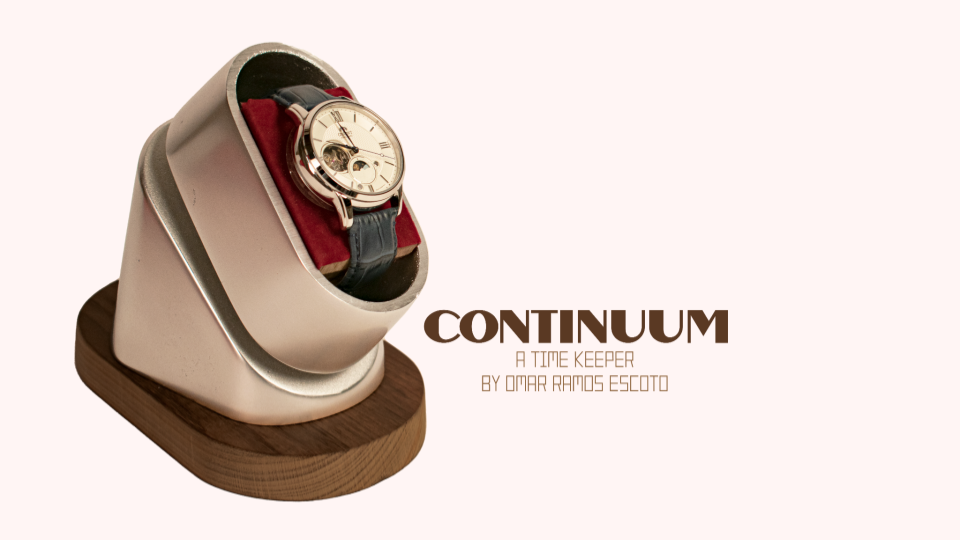
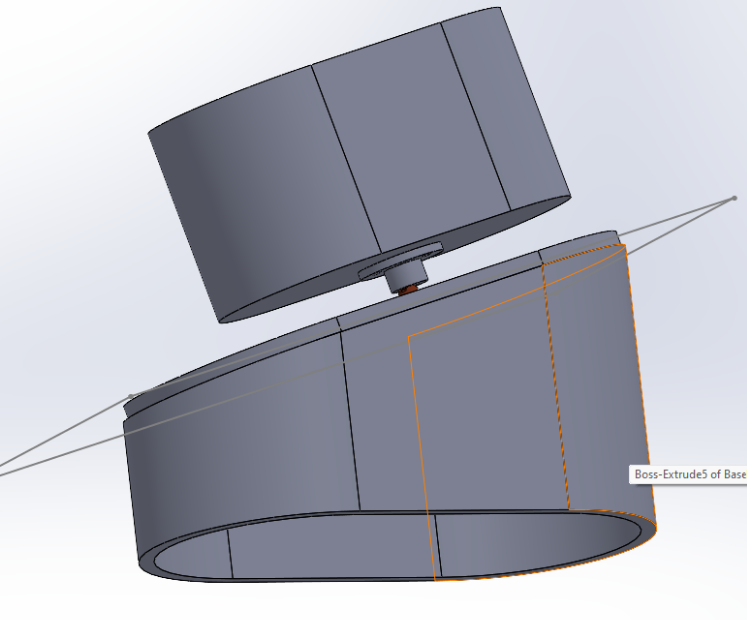

## 🚀 **Project Overview**  
- **Project Name:** Continuum Timekeeper  
- **Role:** Designer & Fabricator  
- **Technologies:** Sandcasting, Milling, SOLIDWORKS, Stepper Motors/Arduino (Minimal)  
- **Class:** ME103: Product Realization: Design and Making
- **Duration:** ~10 weeks  
- **Key Contributions:** CAD Design, Sandcasting, Machining, Surface Finishing, Functional Electronics Integration  

  

---

## 💭 **Inspiration & Meaning**  

Watches have always held a personal significance for me. My dad gifted me my first mechanical watch on my 15th birthday—the first birthday I spent without him after moving to the U.S. Since then, automatic watches have become a passion of mine, representing both home and the spark that led me to study mechanical engineering.  

Automatic watches are designed to be self-winding, relying on the wearer's movement to keep them running. However, when left unworn, they stop, requiring manual winding and resetting. This project aimed to solve that problem: **a custom-made watch winder that keeps an automatic watch running when it's not on my wrist.**  

The final design rotates 650 times per day, enough to keep most automatic watches wound without over-tensioning the mainspring.  

---

## ✏️ **Design & Prototyping**  

The project started with hand-drawn sketches, followed by CAD modeling in SOLIDWORKS. I then created 3D-printed prototypes to evaluate sizing, component interaction, and overall scale.  

  
  
  
  
  

  

These 3D prints became the patterns for sandcasting, requiring significant post-processing:  
- **Filling & sanding** – Smoothing print layer lines for a clean mold  
- **Runner design & fabrication** – Ensuring proper aluminum flow during casting  
- **Testing mold success** – Adjusting draft angles to improve release as this was a big problem with the desired geometry  

  

   

---

## 🔨 **Manufacturing Process**  

The final winder housing was sand-casted in aluminum. This required multiple steps:  

- **3D Print Preparation:** Sanding and sealing prints to create smooth patterns  
- **Sandcasting Process:** Creating a runner system for clean aluminum flow  
- **Post-Casting Processing:** Cutting off the runner, removing imperfections, and refining surfaces  
- **Machining & Assembly:**  
  - **Drilling & tapping** holes for motor mounting and for motor shaft coupler
- **Surface Finishing:**  
  - **Sanding & polishing** for a smooth, high-contrast finish  
  - **Bead blasting** certain surfaces for a matte aesthetic  

  
  
  
  
  
  
  
  

  

---

## ⚙️ **Challenges & Solutions**  

- **Mold Release Issues Due to Sand Trapping**  
  - *Issue:* Sand kept getting trapped in cavities, causing mold pull failures.  
  - *Solution:* Adjusted draft angles and experimented with ramming pressure. Lower ramming force surprisingly solved the issue.  

- **Ensuring Clean Aluminum Flow During Casting**  
  - *Issue:* Early cast attempts had voids and poor material distribution.  
  - *Solution:* Redesigned runner system to improve metal flow.  

- **Runner Removal & Post-Cast Refinement**  
  - *Issue:* The casting required extensive cleanup before machining.  
  - *Solution:* Developed a process for cutting, grinding, and finishing cast parts efficiently.  

---

## 🖼️ **Gallery**  

### **Final Build**  

  
  
  

  

---

## 🎓 **What I Learned**  

✔ **First experience working with machining tools** – Learned best practices for milling, lathe work, welding, and casting.  
✔ **Planning and workflow efficiency** – Realized how small process changes (like ramming technique) significantly affect casting quality.  
✔ **Post-processing is just as important as casting** – Grinding, sanding, and polishing take time but are essential for a clean finish.  
✔ **Pattern preparation is critical** – Properly finishing 3D-printed patterns improved casting success.  

---

## 🌟 **Final Thoughts**  

This project was my first deep dive into *hands-on manufacturing*, where I combined engineering design with real-world fabrication techniques. I got to explore milling, lathe work, welding, woodworking, and casting, all while creating something meaningful to me. It reinforced the importance of *planning, iteration, and precision* in machining and casting, and it was incredibly rewarding to merge my passion for mechanical design, electronics, and watches into a single project.  

---

