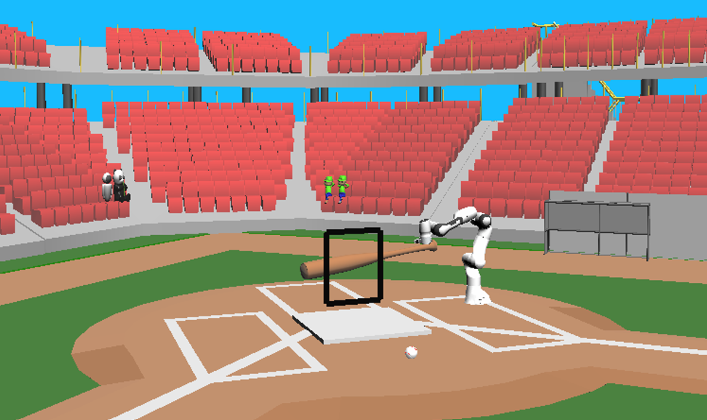
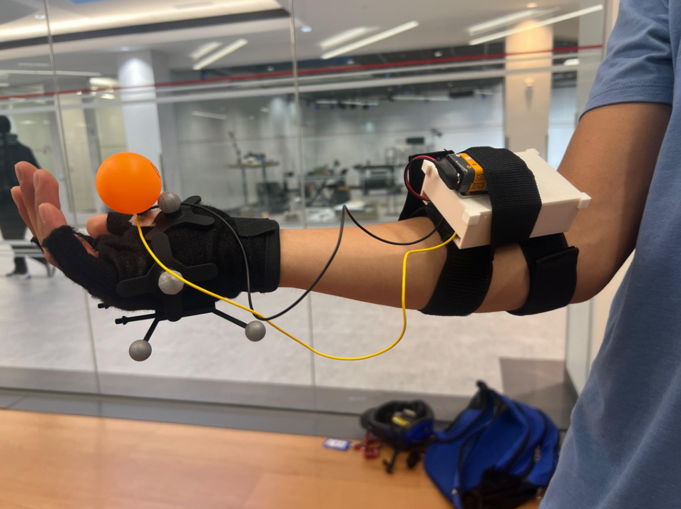

## 🚀 **Project Overview**  
- **Project Name:** Baseball Batting Robot Simulation  
- **Role:** Simulation & System Integration Lead  
- **Technologies:** C++, Multi-threading, Redis, URDF Modeling, OptiTrack Motion Capture, SAI2 Framework (Simulation)  
- **Class:** CS225A: Experimental Robotics  
- **Team Size:** 4 members  
- **Duration:** ~4 weeks  
- **Key Contributions:** Multi-threading for real-time simulation, motion capture integration, URDF modifications, Redis communication setup  
- **🎥 Demo:**  

  
  <iframe src="https://drive.google.com/file/d/1xhVk_wxnq9b8n6N1jESK4fKtTwBk2A3d/preview" width="640" height="480" allow="autoplay"></iframe> 

  

---

## 📖 **Project Summary**  

This project was part of *CS225A: Experimental Robotics*, where we developed a **real-time, physics-based robotic batting simulation**. The system integrates **human-in-the-loop control with robot dynamics and real-world tracking**, allowing a user to throw a virtual ball using motion capture while a simulated Panda robotic arm dynamically reacts to swing.

---

## 🛠️ **Key Technologies & Concepts**  

- **Multi-Threading & Concurrency Control:** Mutexes, atomic flags, and signal handlers ensured safe shared-memory access across threads.  
- **OptiTrack Motion Capture:** Used infrared tracking cameras to capture the hand’s position and release motion in real time.  
- **Redis Communication:** Integrated real-time control messaging between the simulation and external input devices.  
- **URDF Modeling:** Modified the Panda arm’s URDF to include a bat attachment and collision geometry.  
- **SAI2 Simulation Framework:** Used Sai2Graphics, Sai2Simulation, and Sai2Model to run physics-based interactions.    
- **Ball Trajectory & Strike Zone Detection:** Used gravity physics and impact calculations to determine strike validity.  

---

## 👤 **My Role & Key Contributions**  

**Multi-Threading & Synchronization**  
- Designed **separate threads** for simulation updates, user input handling, and Redis communication.  
- Implemented **mutex locks and atomic flags** to **prevent race conditions** when updating shared ball data.  
- Ensured **clean thread joining and shutdown handling** for stable execution.  

**Simulation & URDF Modeling**  
- Modified the Panda URDF model to include a bat attachment with custom collision geometry, ensuring accurate swing interactions with the virtual ball.
- Adjusted mass, inertia, and damping properties for realistic bat motion and impact forces. 

**OptiTrack Motion Capture Integration**  
- Processed hand-tracking data from OptiTrack cameras to determine release velocity.  
- Synchronized hand velocity and release position to accurately launch virtual baseballs.  

**Glove-Based Ball Release Detection**  
- Used **serial communication with Redis** to transmit real-time button presses to the simulator.  
- Custom glove detected ball release events, allowing natural throwing motions to be replicated.  

**Simulation Visualization & Rendering**  
- Managed scene assets, transformations, and dynamic camera adjustments.  
- Implemented strike zone visualization and real-time ball tracking.  

- **Physics-Based Ball Tracking & Strike Detection**  
- Computed gravity-based trajectory intersections to determine if a pitch entered the strike zone.  
- Dynamically adjusted camera view based on whether the ball hit or missed.  

---

## 🔍 **Breakdown of  Simulation & System Design**  

The batting robot simulation required real-time coordination between multiple components: a human throwing motion, a virtual ball launch, and the robotic bat reacting dynamically. To achieve this, the system had to:

1️⃣ Process real-world inputs from the user in real-time, using an OptiTrack motion capture system and a glove-mounted button to track when and how a ball was thrown.

2️⃣ Simulate physics and robot movement at high speed, ensuring that the Panda robotic arm accurately executed swings while tracking the ball's motion.

3️⃣ Continuously update the visualization and interactions, rendering the simulation in sync with physics calculations and adjusting the camera to focus on key events.

To handle these tasks efficiently, I designed a multi-threaded system with separate execution threads for:

- Simulation updates (handling physics, robot control, and ball dynamics).
- User input processing (reading motion capture data and detecting button presses).
- Visualization rendering (ensuring the scene and camera adjusted dynamically).

Since these components were running in parallel, I implemented mutexes (locks) and atomic flags to prevent race conditions—ensuring that physics updates, ball tracking, and user inputs didn't interfere with each other. This approach guaranteed that the robot always reacted correctly to human actions while keeping the simulation running smoothly in real-time. 

---

## 🚩 **Challenges & Solutions**  

- **Ensuring Thread Safety in Multi-Threaded Simulation**  
  - *Challenge:* Multiple threads accessing Redis keys led to **race conditions**.  
  - *Solution:* Used **mutex locks & atomic flags** to control concurrent data updates.  

- **Simulating Realistic Ball Physics & Timing**  
  - *Challenge:* Ball behavior was inconsistent due to rigid body physics limitations.  
  - *Solution:* Tuned **collision properties and damping values** for realistic impact responses.  

- **Synchronizing Hand Tracking with Ball Release**  
  - *Challenge:* Delays in OptiTrack data caused **misaligned launches**.  
  - *Solution:* Applied **low-pass filtering** to **smooth out tracking jitter** before sending data to Redis.  

---

## 🧰 **Technical Stack & Validation**  

- **Programming:** C++, Python  
- **Frameworks & Libraries:** SAI2 (Simulation, Graphics, Control), Redis, Eigen  
- **Concurrency & Communication:** Threads, Mutexes, Redis Messaging  
- **Motion Capture:** OptiTrack for real-world hand tracking  
- **Robotics Modeling:** Custom URDF for Panda arm with bat attachment  

---

## 🌟 **Project Highlights**

- **Built a real-time human-in-the-loop robotic simulation** with physics-based interactions.  
- **Designed multi-threaded synchronization** between real-world tracking & virtual robot control.  
- **Developed a fully interactive system** where a human controlled ball launches, and the simulated robot reacted dynamically.  

---

## 📸 **Gallery**  

- **Human In The Loop Demo:**  

  
  <iframe src="https://drive.google.com/file/d/1xhVk_wxnq9b8n6N1jESK4fKtTwBk2A3d/preview" width="640" height="480" allow="autoplay"></iframe> 

  

- **Simulation Close Up:**

 
<iframe src="https://drive.google.com/file/d/1wRcG3fQEHXlYjDe7MZf0lZAsqWea6bDt/preview" width="640" height="480" allow="autoplay"></iframe>

  

 

- **Glove (Tracking and Release Button):**  

  

  

---

## 📂 **Project Documentation**  
<ul>
  <li>📄 <a href="../assets/docs/BaseballBatEmulator_FinalReport.pdf" target="_blank">Final Report</a></li>
  <li>🔗 <a href="https://github.com/aby25jose/cs225a-baseball" target="_blank">GitHub Repository</a></li>
  <li>🔗 <a href="https://khatib.stanford.edu/projects/controlandsimulation.html" target="_blank">SAI2</a></li>
</ul>