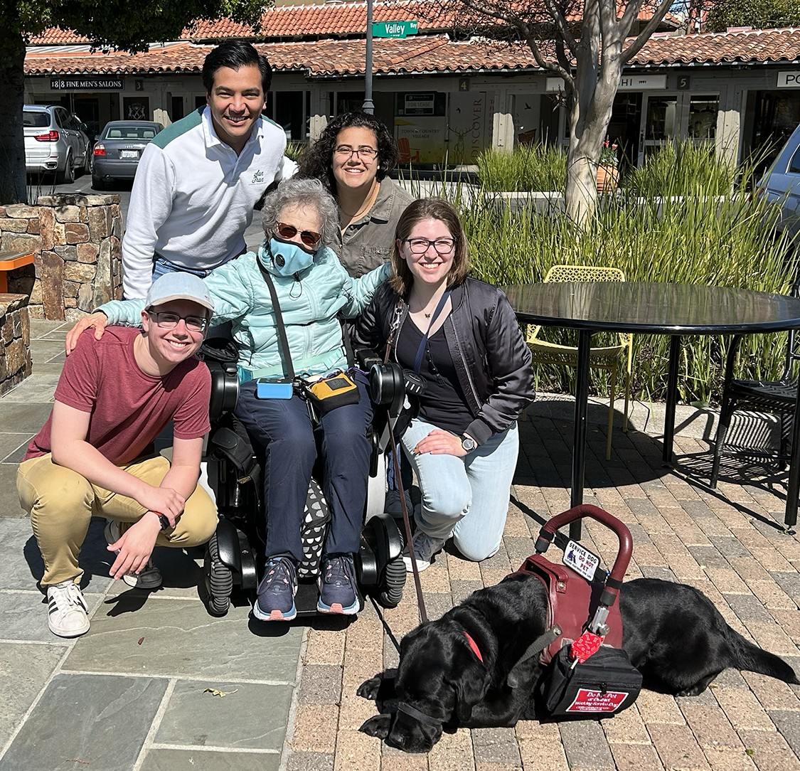

## 🚀 **Project Overview**  
- **Project Name:** DUG - *A Communication Device for Service Dogs*  
- **Role:** Component Sourcing and Integration
- **Technologies:** Raspberry Pi Zero 2 W, Bluetooth, Bash Scripting, Soldering, 3D Printing  
- **Class:** ENGR210: Perspectives in Assistive Technology  
- **Team Size:** 4 members  
- **Duration:** ~10 weeks  
- **Key Contributions:** User Testing & Feedback Integration, Need-Finding, Component Sourcing, Physical Assembly
- **🏆 Competition:** **2nd Place in Rehabilitation Engineering and Assistive Technology Society of North America (RESNA) Student Design Challenge 2023**  
- **Documentation:** 📄 <a href="../assets/docs/Final_Report_Team_DUG.pdf" target="_blank" rel="noopener noreferrer">Final Report</a> & <a href="../assets/docs/Final_Presentation_Team_DUG.pdf" target="_blank" rel="noopener noreferrer">Final Presentation </a>  
- **🎥 Demo:**  

  
  <iframe src="https://drive.google.com/file/d/1-ASJiJHEltRLDb4_5OTTaip5yUn843Gn/preview" width="640" height="480" allow="autoplay"></iframe>  

  

  <iframe src="https://drive.google.com/file/d/1pZtKGCFRtPMgb_O8sjD-Rnyk8t-BIPJf/preview" 
          frameborder="0" 
          width="800" 
          height="600"></iframe>

---

# **DUG: Giving Service Dogs a Voice**

DUG is a **custom-built assistive technology device** designed to help service dog handlers communicate with the public and prevent distractions to their working companions. The system consists of a Bluetooth speaker and a handheld remote control, allowing users to trigger pre-recorded messages that remind passersby not to interact with their service dog.  

This project was developed through **direct collaboration with a service dog user**, ensuring a user-centered design process. The final prototype was tailored to meet **specific accessibility needs**, including **button selection for limited dexterity** and **flexible attachment options** for mobility devices.

---

## 🛠️ **Key Technologies & Concepts**  
- **Embedded Linux & Bash Scripting** (Raspberry Pi-based system)  
- **Wireless Communication** (Bluetooth speaker integration)  
- **Human-Centered Design & Accessibility** (Iterative prototyping with user feedback)  
- **3D-Printed Ergonomic Remote** (Textured buttons for tactile feedback)  
- **Custom Circuit Assembly & Soldering** (Perfboard circuit construction)  
- **Assistive Technology Product Development** (Designed for real-world usability)  

---

## 👤 **My Role & Key Contributions**  

- **Component Sourcing & Hardware Selection:** Researched and sourced all critical components, including the Raspberry Pi, Power Source, Bluetooth speaker, and accessibility-focused buttons.  
- **User-Driven Design & Testing:** Worked closely with our user to refine the remote control design based on dexterity limitations and ease of use.  
- **Electrical System Assembly:** Soldered and integrated the remote's push-button system onto a perfboard circuit, connected to the Raspberry Pi’s GPIO pins.  
- **Embedded Software & System Integration:** Assisted in Bash scripting to handle button inputs, trigger audio playback, and maintain Bluetooth connectivity.  
- **CAD Refinements:** Contributed to design adjustments for the 3D-printed remote enclosure to ensure proper fitment of internal electronics.  
- **Documentation & Competition Presentation:** Helped compile extensive documentation detailing design evolution, user feedback, and technical decisions.

---

## 🚩 **Key Challenges & Solutions**  

- **Ensuring Reliable Wireless Playback:**  
  - *Challenge:* Maintaining a stable Bluetooth connection between the Raspberry Pi and speaker.  
  - *Solution:* Implemented a *systemd service* to automatically reconnect on power-up and handle unexpected disconnections.  

- **Accessibility-Optimized User Interface:**  
  - *Challenge:* Designing a controller that is comfortable and easy to operate for users with limited dexterity.  
  - *Solution:* Tested multiple button sizes and tactile features, incorporating user feedback to select an ergonomic, easy-to-press and differentiate button layout.  

- **Physical Durability & Portability:**  
  - *Challenge:* Ensuring the remote is lightweight, robust, and easy to attach to various mobility devices.  
  - *Solution:* 3D-printed the case using PC-ABS for strength and included a carabiner attachment for flexible placement.  

- **Battery Optimization & Power Management:**  
  - *Challenge:* Balancing battery life with portability.  
  - *Solution:* Selected a long-lasting portable battery and ensured efficient power consumption by running a minimalist Linux system on the Raspberry Pi.  

---

## 📸 **Gallery**  
 

  
  

---

## 📂 **Project Documentation**  
- 📄 <a href="../assets/docs/Final_Report_Team_DUG.pdf" target="_blank" rel="noopener noreferrer">Final Report (PDF)</a>  
- 📄 <a href="../assets/docs/Final_Presentation_Team_DUG.pdf" target="_blank" rel="noopener noreferrer">Final Presentation </a>  
- 🌐 <a href="https://www.resna.org/Events/2025-RESNA-Conference/2025-Student-Design-Challenge/2023-Student-Design-Challenge" target="_blank" rel="noopener noreferrer">RESNA Student Design Challenge</a>  

---
