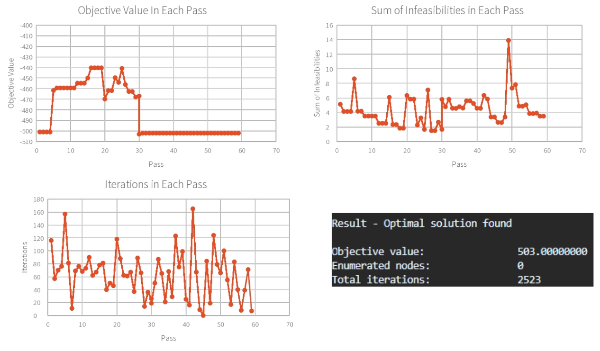
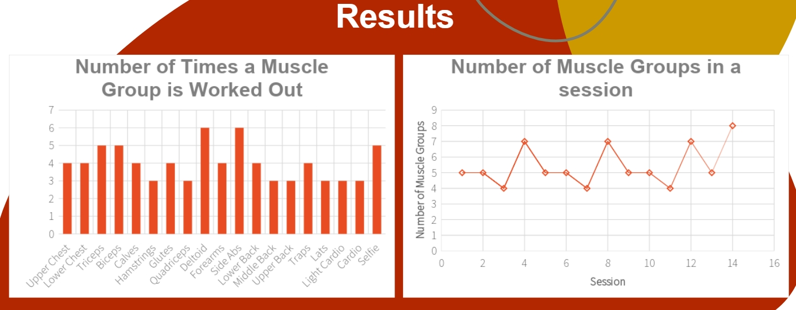
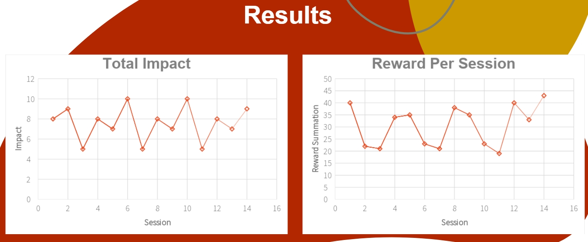

## 🚀 **Project Overview**  
- **Project Name:** Optimal Workout Scheduling Using Mixed Integer Linear Programming  
- **Role:** Optimization & Algorithm Design  
- **Technologies:** Python, PuLP, Mixed Integer Linear Programming (MILP), Constraint Optimization 
- **Class:** CS361: Engineering Design Optimization  
- **Key Contributions:** Developed an optimization model for personalized workout scheduling using MILP.  

---

## 📖 **Project Summary**  
This project focuses on optimizing workout schedules using Mixed Integer Linear Programming (MILP). The model balances workout efficiency, personal preferences, and recovery constraints to generate a personalized plan.  

💡 **Core Idea:** Define workouts as *decision variables*, enforce time, fatigue, and dependency constraints, and use MILP to maximize workout effectiveness.  

### **Key Features Implemented:**  
✅ **Mathematical Problem Formulation** – Modeled exercises, session times, and recovery constraints in an optimization framework.  
✅ **Personalized Optimization Criteria** – Included custom user-defined ‘rewards’ for different muscle groups.  
✅ **Time & Recovery Constraints** – Ensured no overtraining by enforcing recovery time and session limits.  
✅ **Exercise Dependencies & Incompatibilities** – Incorporated logical constraints (e.g., some exercises require others to be done first).  
✅ **PuLP MILP Solver Implementation** – Used Python’s PuLP library with branch-and-bound techniques for optimization.  

---

## 🛠️ **Key Technologies & Concepts**  
- **Mixed Integer Linear Programming (MILP)** – Solved discrete & continuous decision problems with an optimality guarantee.  
- **Constraint Programming** – Modeled recovery time, fatigue accumulation, and variety constraints.  
- **Algorithmic Optimization** – Balanced efficiency & flexibility using mathematical techniques.  
- **Python & PuLP Library** – Implemented and solved the model programmatically.  

---

## 🚀 **Results & Insights**  
- **Generated a structured and balanced 2-week workout plan** that adapts to user preferences.  
- **Ensured consistent workout distribution** by enforcing recovery time, session limits, and variety constraints.  
- **Effectively handled dependencies and incompatibilities**, ensuring no conflicting exercises were scheduled together.  
- **Demonstrated trade-offs between intensity, recovery, and workout diversity**, producing a schedule that maximized efficiency while maintaining balance.  

---

## 🎥 **Visuals**  
**Results:**  

  
  
  

  

---

## 🚩 **Challenges & Solutions**  
- **Ensuring Feasible & Realistic Schedules**  
  - Fine-tuned **constraints to avoid unbalanced or unrealistic workout plans**.  

- **Balancing Computational Efficiency with Complexity**  
  - Adjusted **constraint formulation to improve solver speed without sacrificing accuracy**.  

- **Extending Beyond Simple Linear Constraints**  
  - Future work includes **nonlinear models, AI integration, and user feedback loops**.  

