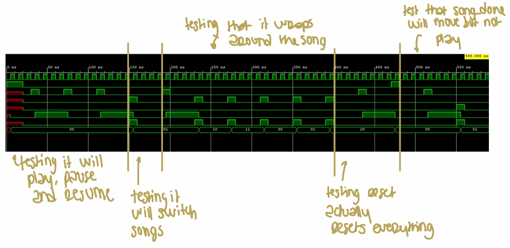
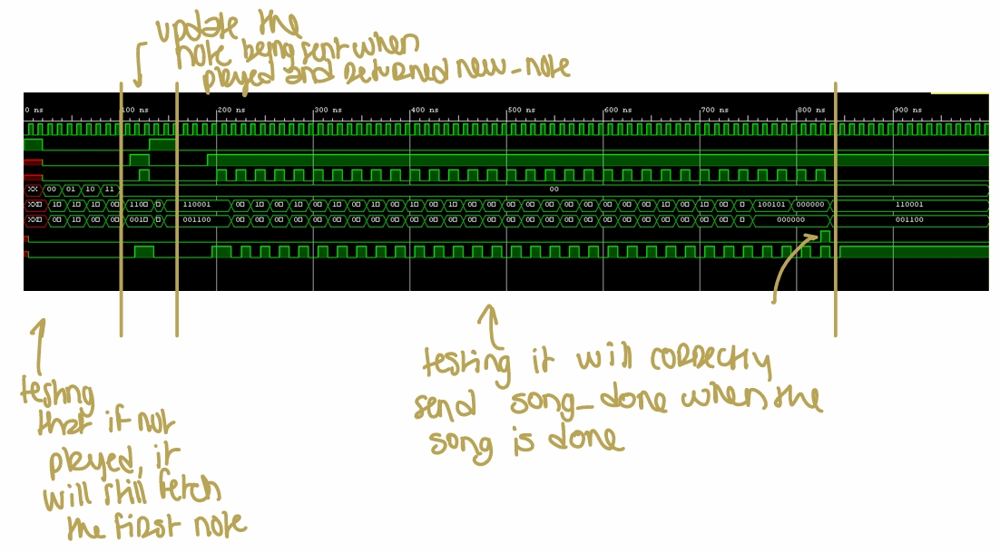

## 🚀 **Project Overview**  
- **Project Name:** FPGA Music Synthesizer & Waveform Display  
- **Role:** Team-Based Development  
- **Technologies:** Verilog, FPGA (PYNQ Board), Digital Signal Processing, VGA Display, Audio Codec (ADAU1761), Finite State Machines (FSMs)  
- **Class:** EE108: Digital System Design  
- **Team Size:** 3 members  
- **Duration:** ~3 weeks  
- **Key Features:** Real-time audio synthesis, waveform visualization, playback control, chords/harmonics generation  

---

## 📖 **Project Summary**  

This project involved designing and implementing an **FPGA-based digital music synthesizer**, capable of playing stored songs using digitally generated sine waves. The system featured **real-time waveform visualization on a VGA screen** and supported **advanced playback features** such as fast-forward, rewind, and harmonics.  

The project combined **digital audio synthesis, signal processing, and real-time visualization**, requiring an in-depth understanding of **hardware description languages (Verilog), finite state machines (FSMs), digital logic design, and FPGA-based development**.

The core system consisted of:  
- **A custom Verilog-based music player** that synthesized audio from stored song data.  
- **Playback control features**, including fast-forward and rewind, ensuring precise song playback in both directions.  
- **Support for chords and harmonics**, enabling richer and more complex sound synthesis.  
- **A real-time waveform display**, allowing dynamic visualization of the generated audio.  

---

## 🛠️ **Key Technologies & Concepts**  

- **FPGA-Based Digital Audio Synthesis**  
  - Implemented a **hardware music player** capable of playing sine-wave tones stored in ROM.  
  - Used **parallel note generators** to create **chords and harmonics**.  

- **Playback Control & Timing Management**  
  - Designed an **FSM-based system** to manage **play, pause, fast-forward, and rewind** operations.  
  - Implemented a **rewind-aware song ROM**, ensuring smooth reverse playback of notes and chords.  

- **Waveform Display & VGA Output**  
  - Developed a **real-time waveform visualization** on an 800x480 VGA display.  
  - Implemented **adjustable display scaling**, allowing dynamic resizing of the waveform based on user input.  

- **Digital Signal Processing & Audio Effects**  
  - Integrated **harmonics generation**, simulating different instrument sounds by adding frequency multiples.  
  - Applied amplitude modulation techniques to enhance audio quality.  

---

## 🎵 **Key Features Implemented**  

### **1️⃣ Playback Control (Fast-Forward & Rewind)**  
- Implemented an **interface for playback manipulation**, allowing users to **fast-forward and rewind** through songs.  
- Fast-forwarding was achieved by **cutting note durations in half**, making playback occur at **2x speed**.  
- Rewinding was implemented by **decrementing the note counter**, ensuring that notes were retrieved in perfect reverse order.  
- Updated the **song ROM format** to handle different types of rests (normal & rewind), preventing desynchronization in complex arrangements.  

### **2️⃣ Chord Support (Multiple Simultaneous Notes)**  
- Extended the music player to **support polyphonic playback**, allowing **three notes to play simultaneously**.  
- Modified the **song reader FSM** to correctly schedule **multiple notes in parallel**, preventing timing mismatches.  
- Combined multiple sine waves into a **single output waveform**, accurately synthesizing chords.  

### **3️⃣ Harmonics (Complex Sound Generation)**  
- Implemented **harmonic frequency synthesis**, adding **weighted multiples** of the fundamental frequency to simulate instrument-like timbres.  
- Created **parallel sine-wave generators** for **fundamental, 2nd, and 3rd harmonics**, applying amplitude scaling for proper audio balance.  
- Integrated harmonics processing into the **note player module**, allowing per-note harmonic customization.  

### **4️⃣ Adjustable Waveform Display (VGA Visualization)**  
- Developed a **real-time waveform display** to visually represent the generated audio.  
- Implemented **user-controlled scaling**, allowing adjustment of **height (amplitude) and width (time scale)** via FPGA switches.  
- Optimized **display logic** to ensure smooth rendering of the waveform.  

---

## 🚩 **Challenges & Solutions**  

- **Ensuring Accurate Playback Timing**  
  - *Challenge:* Fast-forwarding and rewinding caused synchronization issues with note durations.  
  - *Solution:* Modified the **song ROM format** to properly track playback direction and rest durations.  

- **Generating Chords & Harmonics in Hardware**  
  - *Challenge:* Playing multiple notes simultaneously required efficient waveform combination.  
  - *Solution:* Used **parallel waveform generators** and **frequency scaling** to generate harmonics.  

- **Waveform Display Scaling & Resolution**  
  - *Challenge:* Displaying high-resolution waveforms while maintaining smooth real-time updates.  
  - *Solution:* Implemented **scalable visualization logic** with user-adjustable display modes.  

---

## 📚 **Key Learnings from EE108**  

Beyond the final project, EE108: Digital System Design covered a broad range of fundamental and advanced digital design concepts, many of which were applied in this project. These included:  

- **Combinational & Sequential Logic Design** – Learned how to optimize logic circuits for efficiency and performance.  
- **Finite State Machines (FSMs)** – Designed and implemented FSMs to manage playback, note scheduling, and user input handling.  
- **Pipelining & Timing Analysis** – Applied timing constraints to ensure real-time operation of the music player.  
- **FPGA Development & Hardware Debugging** – Used **Vivado & simulation tools** to debug and synthesize Verilog designs.  
- **Verilog & Hardware Description Languages** – Developed and tested **custom Verilog modules for audio processing and visualization**.  

---

## 🧰 **Technical Stack & Validation**  

- **Hardware Development:** FPGA (PYNQ Board), Audio Codec (ADAU1761)  
- **Programming:** Verilog (Synthesis & Simulation)  
- **Digital Signal Processing:** Harmonics synthesis, frequency scaling  
- **Visualization:** VGA output, waveform rendering  
- **Finite State Machines:** Playback control, note scheduling  
- **Simulation Screenshots (Playback & Controls in Action):**  

  
  

---

## 🌟 **Project Highlights**  

- **Designed a real-time FPGA-based music synthesizer from scratch using Verilog.**  
- **Implemented playback control, chords, and harmonics synthesis for enhanced audio quality.**  
- **Developed a fully interactive playback system with fast-forward and rewind.**  
- **Created a dynamic waveform visualization using VGA output.**  

---

## 📂 **Project Documentation**  

- 📄 [Final Project Report (PDF)](../assets/docs/EE108_Write_up.pdf){:target="_blank"}
