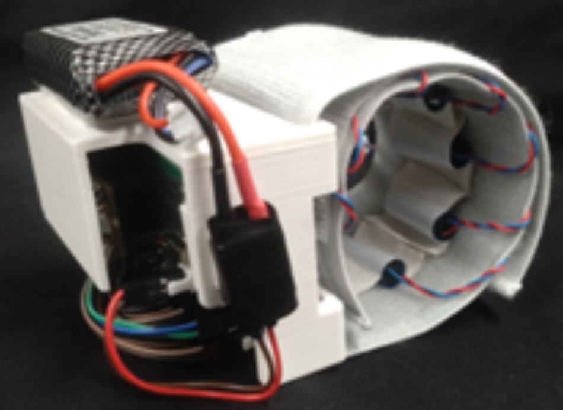
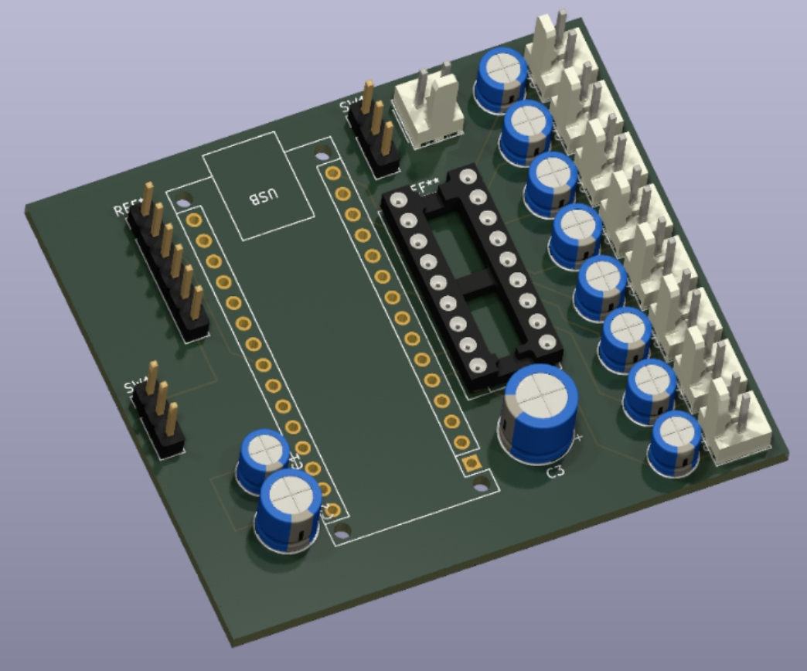
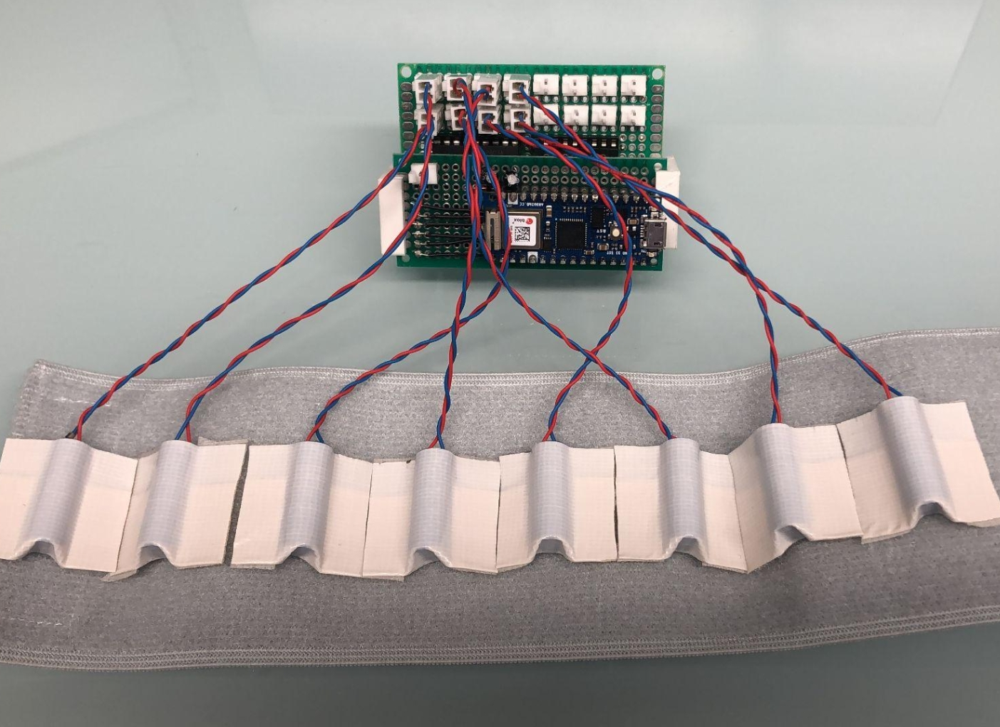
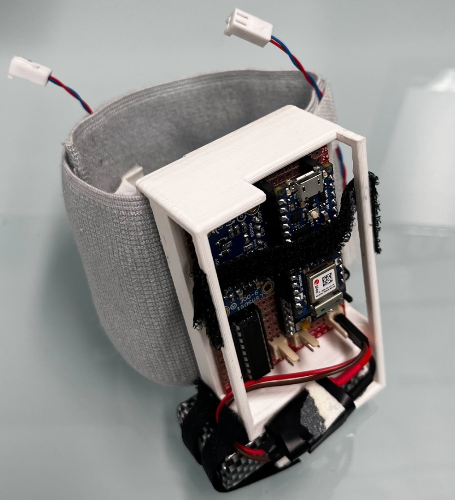
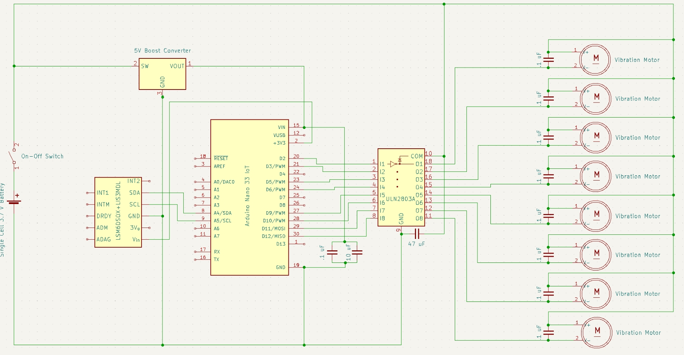
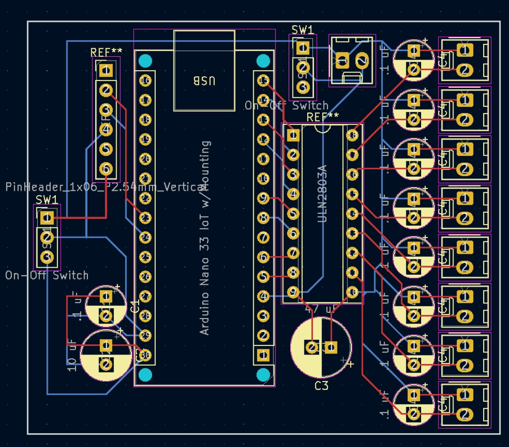
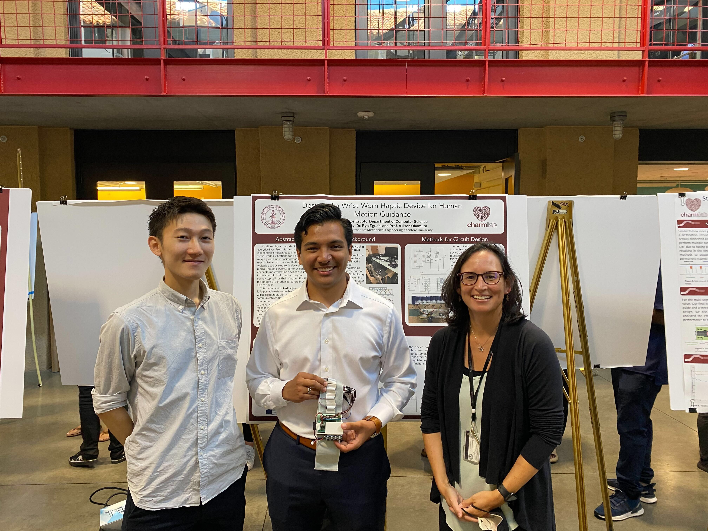

## 🚀 **Project Overview**  
- **Project Name:** Wrist-Worn Haptic Feedback Device  
- **Role:** Embedded Systems Engineer  
- **Technologies:** Embedded C++, PCB Design (KiCad), Bluetooth (Classic & BLE), I2C, PWM Motor Control, IMU-based Feedback, Power Management  
- **Lab:** Stanford CHARM Lab (Collaborative Haptics and Robotics in Medicine)  
- **Mentors:** Dr. Ryo Eguchi, Dr. Allison Okamura  
- **Duration:** Summer Quarter 2022, SURI (Stanford Undergraduate Research Institute)
- **Key Contributions:** Circuit Design, Bluetooth Communication, IMU Integration, Power Management, Custom PCB  
- **Documentation:** [Research Poster (PDF)](../assets/docs/SURI_Poster.pdf){:target="_blank"}

  
  

---

# **Wrist-Worn Haptic Device for Motion Guidance**  

This project focused on developing a wrist-worn haptic device capable of providing real-time motion guidance through vibrotactile feedback, enabling intuitive, non-visual communication of movement cues. Designed for assistive technology and rehabilitation, the system integrates IMU-driven feedback, wireless control, and miniaturized electronics into a compact wearable device.

---

## 🛠️ **Key Technologies & Concepts**  
- **Embedded Systems & Firmware Development**  
  - Implemented Bluetooth Classic communication on an **Arduino Nano 33 IoT**, replacing the default BLE for increased speed.  
  - Initially planned for a large number of motors, but the **Arduino Nano 33 IoT lacked enough PWM outputs**. To solve this, I sourced and implemented an **I2C-based PWM driver board** (PCA9685), which allowed motor control with only two I2C pins while supporting multiple outputs.  
  - After building the physical prototype, we determined that **fewer motors** were needed than originally assumed. This allowed me to **replace the PWM driver with a ULN2803 Darlington array**, simplifying the circuit and enabling direct motor control from the Arduino in the final PCB version.  
  - Integrated **real-time IMU-based feedback** for dynamic haptic responses.  

- **Circuit Design & Power Management**  
  - Designed a power-efficient circuit that allowed all components to operate off a **single LiPo battery**.  
  - Used a **DC-DC step-up converter** to provide stable power to the microcontroller while isolating motor power.  
  - Added **decoupling capacitors** to prevent power fluctuations from interfering with the Arduino during rapid motor actuation.  

- **Custom PCB Design for Miniaturization**  
  - Redesigned the circuit onto a **two-layer PCB in KiCad**, reducing size and improving robustness.  
  - Incorporated a **ULN2803 8-Channel Darlington Driver** for compact, efficient motor control.  
  - Designed the PCB to be modular, making it adaptable for multiple CHARM Lab projects.  

- **Wearable Integration & Mechanical Design**  
  - Designed a **3D-printed housing** for the electronics and motors.  
  - Mounted the system onto a **velcro armband**, allowing motors to be repositioned based on experimental needs.  

---

## 👤 **My Role & Key Contributions**  

- **Component Selection & Sourcing**  
  - Researched and selected an appropriate Arduino with Bluetooth compatibility and sufficient processing power.  
  - Sourced vibration motors with optimal frequency and intensity for haptic feedback applications.  
  - Chose a power-efficient LiPo battery and designed the circuit for stable operation under dynamic loads.  

- **Embedded Software Development**  
  - Enabled **Classic Bluetooth communication** on the Arduino by flashing the ESP32 firmware, achieving higher data rates.  
  - Initially designed the **PWM control system using an I2C-based PWM driver board (PCA9685)** to expand the number of available motor outputs while minimizing Arduino pin usage.  
  - After hardware testing revealed fewer motors were needed, redesigned the system to use a **ULN2803 Darlington Driver**, enabling direct motor control from the Arduino in the final PCB version.  
  - Integrated **I2C communication for both the PWM driver (initial version)** to minimize pin usage and simplify data flow.  
  - Developed an **IMU-based feedback system**, allowing the device to provide directional haptic cues based on motion.  

- **Power Optimization & Circuit Design**  
  - Improved power regulation by incorporating a **DC-DC boost converter**, ensuring stable operation of the microcontroller.  
  - Prevented motor-induced power fluctuations from resetting the Arduino by adding **noise-suppression capacitors**.  

- **Custom PCB Development**  
  - Designed a **compact two-layer PCB** to consolidate all components into a smaller footprint.  
  - Transitioned from **I2C PWM driver** to **direct PWM control via a ULN2803 Darlington Driver**, reducing complexity while maintaining efficient motor actuation.  

- **Mechanical Design & Assembly**  
  - Designed and 3D-printed a **custom enclosure** for the board and motors.  
  - Mounted all components onto a flexible **wearable armband** for easy testing and user studies.  

---

## 🚩 **Key Challenges & Solutions**  

- **Bluetooth Communication Limitations**  
  - *Challenge:* The Arduino Nano 33 IoT only supported BLE, which introduced latency too high for real-time haptic feedback.
  - *Solution:* Reflashed the ESP32 firmware to enable **Classic Bluetooth**, achieving significantly reduced latency and smoother haptic updates.

- **Power Instability Due to Motor Load Fluctuations**  
  - *Challenge:* Rapid motor actuation caused voltage drops, occasionally resetting the microcontroller and disrupting real-time operation.  
  - *Solution:* Integrated **decoupling capacitors** and a **DC-DC step-up module**, ensuring stable voltage levels and preventing unexpected resets during high-power motor activation. 

- **PWM Control & Hardware Evolution**  
  - *Challenge:* The Arduino had limited PWM outputs, requiring an external I2C-based PCA9685 PWM driver to control multiple motors. 
  - *Solution:* After testing, we determined fewer motors were needed than originally planned, allowing me to switch to a ULN2803 Darlington Driver, which **simplified the circuit, eliminated I2C overhead, and reduced power consumption**.

- **I2C-Based Peripheral Communication**  
  - *Challenge:* The system needed to interface with multiple components while keeping pin usage low.  
  - *Solution:* Implemented **I2C for both the initial PWM driver and external IMU**, ensuring efficient data transfer with minimal microcontroller pin requirements.  

- **Minimizing Circuit Size & Weight for Wearability**  
  - *Challenge:* The initial design was too large and heavy due to multiple breakout boards.  
  - *Solution:* Designed a **custom PCB**, consolidating components into a smaller and more modular form factor.  

---

## 🧰 **Technical Stack & Validation**  

- **Microcontroller Development:** Arduino Nano 33 IoT (ESP32-based)  
- **Firmware Development:** C++ (Arduino)  
- **Communication Protocols:** Bluetooth Classic, I2C, PWM  
- **Hardware Design Tools:** KiCad (PCB), Oscilloscope for signal analysis  
- **Mechanical Design:** Fusion 360 (3D-printed enclosure)  
- **Power Analysis:** LiPo battery optimization, DC-DC step-up conversion  

**Testing & Validation:**  
- Verified Bluetooth connectivity & data transmission speeds.  
- Stress-tested power system under dynamic motor actuation.  
- Calibrated IMU-based feedback algorithms for motion responsiveness.  

---

## 🌟 **Project Highlights**  

- Successfully **converted an LED driver board into a motor driver**, reducing computational load on the Arduino.  
- Designed a **custom PCB**, significantly reducing the device's size and weight.  
- Implemented **Bluetooth Classic**, enabling real-time haptic feedback communication.  
- Created a **modular wearable design**, making the device adaptable for future CHARM Lab projects.  

---

## 💡 **Reflection & Lessons Learned**  

This project provided hands-on experience in embedded systems, wearable technology, and circuit design. I learned how to:  
- Debug and modify Bluetooth firmware for **higher-speed communication**.  
- Optimize **power management** in a system with rapidly changing loads.  
- Design **modular, adaptable PCBs** for multi-use research applications.  

This experience has further strengthened my skills in embedded system architecture, PCB design, and wearable device development, preparing me for future work in haptic interfaces and assistive technology.

---

## 📸 **Gallery**  

- **Early Testing & Circuit Prototyping:**  

  
  
  

- **Custom PCB Layout in KiCad for planned next iteration:**  

  
  
  

- **SURI Poster Presentation:**  

  

---

## 📂 **Project Documentation**  

- 📄 [Research Poster (PDF)](../assets/docs/SURI_Poster.pdf){:target="_blank"}
