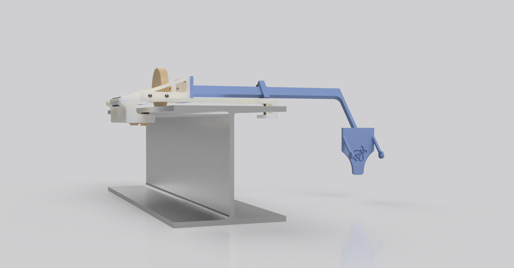
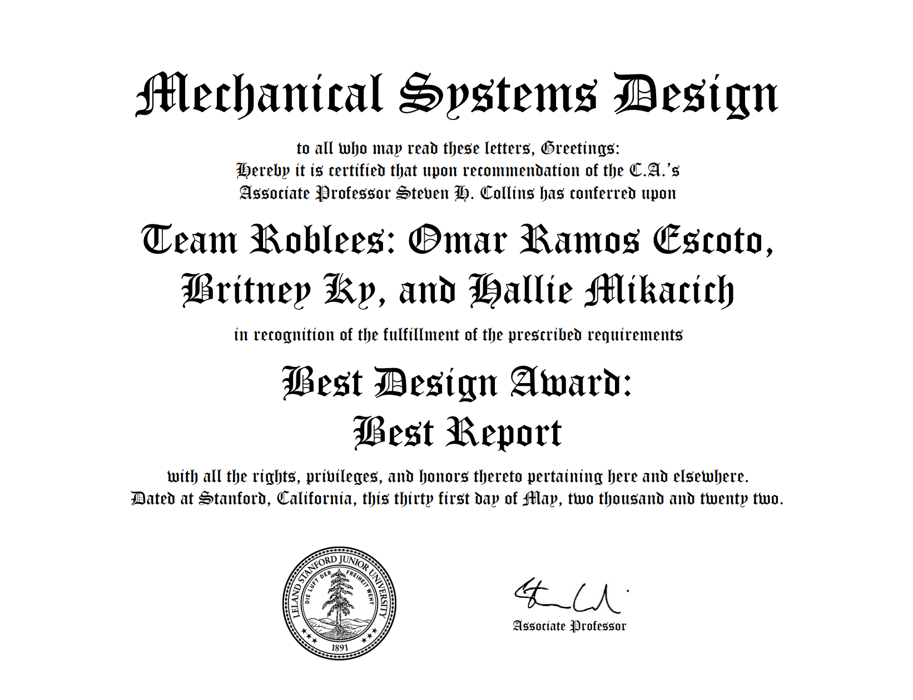
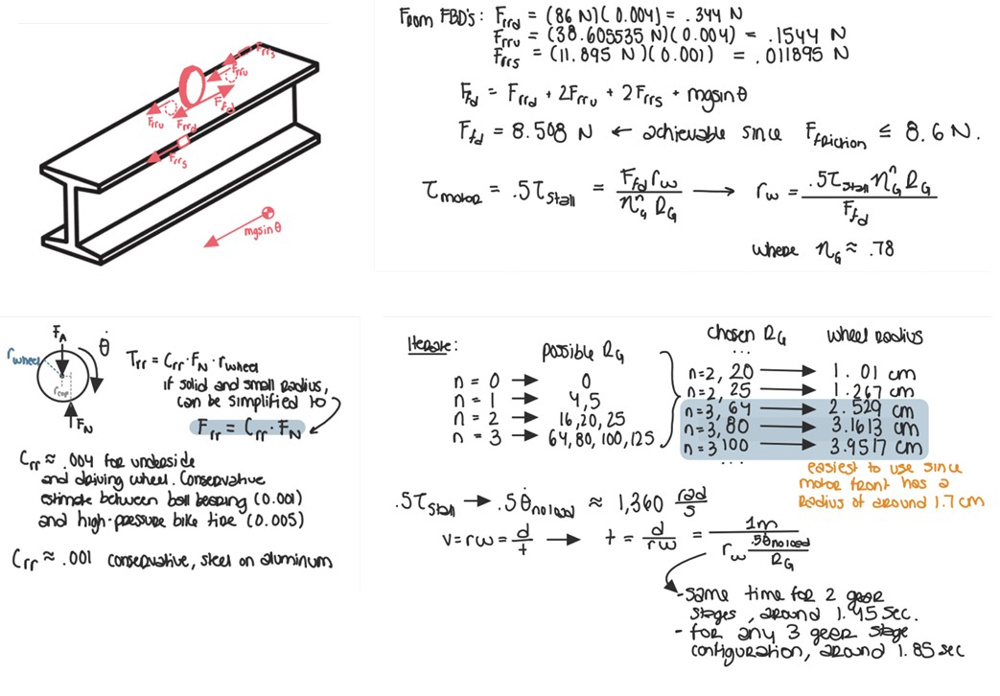
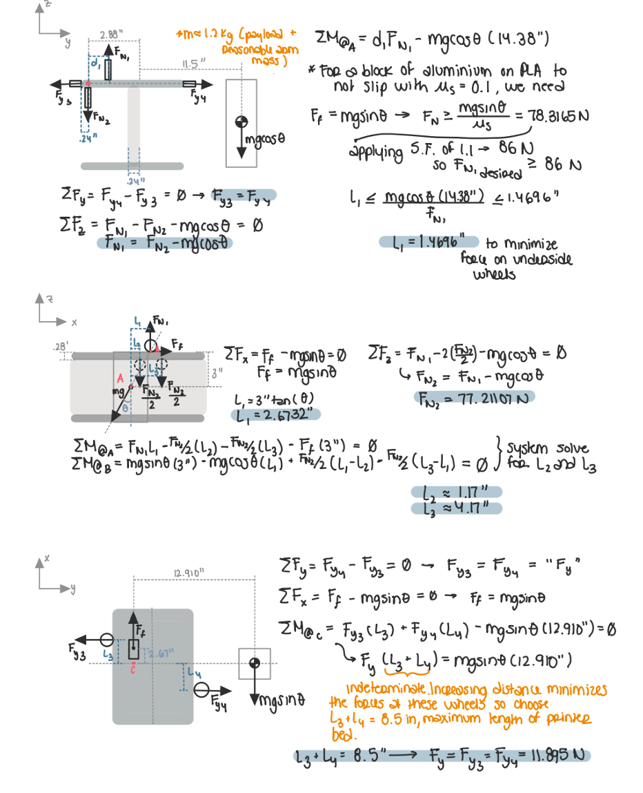
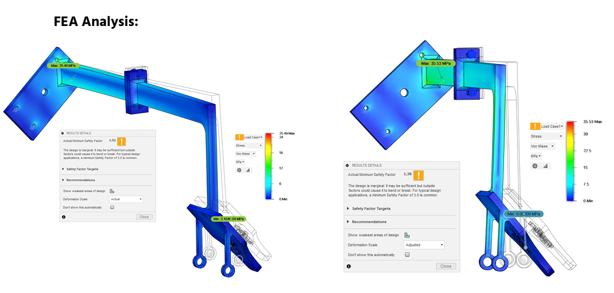
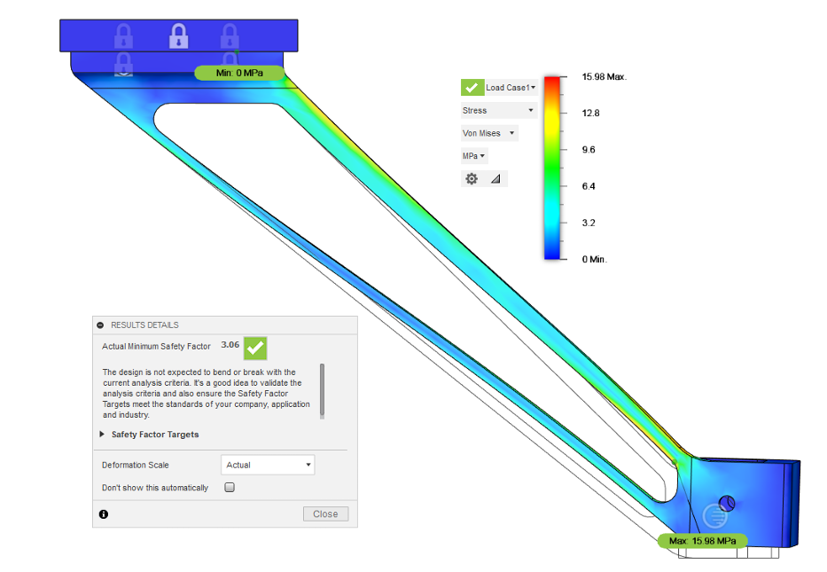
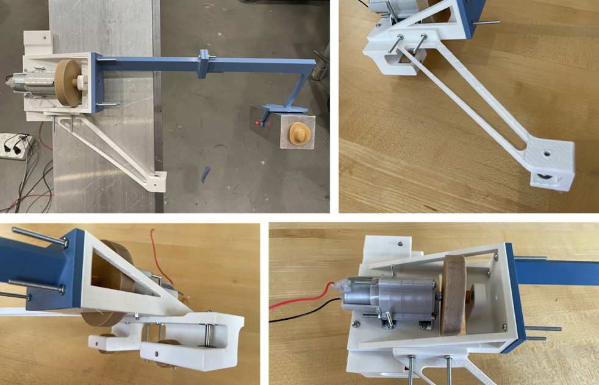

## 🚀 **Project Overview**  
- **Project Name:** Going the Distance Robot  
- **Role:** Mechanical Systems Designer  
- **Technologies:** Motor Characterization, FEA, CAD (Fusion 360), Geartrain Design, Power Transmission  
- **Class:** ME104: Mechanical Systems Design  
- **Duration:** ~3 weeks  
- **Team Members:** 3 members
- **Key Contributions:** Motor Testing, Transmission Optimization, Structural Analysis, High-Performance Design  
- **Documentation:** 
  - 📄 <a href="../assets/docs/Project_2---Description.pdf" target="_blank" rel="noopener noreferrer">Project Description Handout</a> 
  - 📄 <a href="../assets/docs/ME104_Project_2_Report.pdf" target="_blank" rel="noopener noreferrer">Final Report </a>
  - 💾 <a href="https://a360.co/3Gw8ZTi" target="_blank" rel="noopener noreferrer">CAD Assembly </a> 

  

  
  <iframe src="https://drive.google.com/file/d/1u5k1MSxgbYmf6u4M6NyjfDXX6lbgR8Ik/preview" width="640" height="480" allow="autoplay"></iframe>

 

---

## 🎯 **Project Objective & Constraints**  

This project challenged us to design, fabricate, and optimize a **robot that could climb a 1-meter-long inclined I-beam as fast as possible while carrying an offset payload**.  

**Constraints & Requirements:**  
✔ **Single Motor Drive:** Only one **Tamiya 72001 DC motor** (characterized by our team) could be used.  
✔ **Payload Handling:** The aluminum payload had to remain in a fixed **offset position** relative to the I-beam.  
✔ **Gearbox Selection:** We could only use a **Tamiya planetary gearbox** with a selectable gear ratio.  
✔ **Material Limitations:** Custom parts had to be **3D-printed in PLA**.  
✔ **Modular Assembly:** Robot had to be **mounted within 1 minute**.  
✔ **No External Inputs:** The system had to climb **autonomously**, without any external force.  

🏆 **Results:**  
- **🏅 Awarded "Best Report"** for detailed analysis and clear engineering reasoning.  
- **⚡ 2nd Fastest Team:** Achieved near-optimal climb time, just *under 1 second behind* the fastest team.  

  

  <iframe src="../assets/docs/ME104_Project_2_Report.pdf" 
          width="100%" 
          height="600px"></iframe>

---

## 🛠️ **Design & Analysis**  

To optimize climbing speed while maintaining stability, we focused on **power efficiency, traction, and mass distribution**.  

### **1️⃣ Motor & Transmission Optimization**  
- **Motor Characterization:** Measured actual **torque-speed curve** to determine **optimal set-point**.  
- **Voltage Selection:** Applied **6V (maximum allowed)** at **half max torque** to ensure peak **mechanical power output**.  
- **Gear Ratio Calculation:** Optimized drive-wheel radius and selected an **80:1 planetary gearbox** for best speed-torque tradeoff.  

  

---

### **2️⃣ Traction & Stability Strategy**  
- **Increased Normal Force:** Designed an offset **cantilever payload arm** to apply a moment that increased the normal force on the drive wheel, preventing slip.  
- **Multi-Wheel Design:** Used **idle wheels** on both I-beam flanges to counteract moments that could tip the robot.  
- **Bearing-Integrated Idle Wheels:** Minimized friction losses by **press-fitting bearings** into the wheel hubs.  

  

---

### **3️⃣ Structural & FEA Analysis**  
- **Cantilever Payload Arm:** Minimized deflection to ensure consistent **loading conditions**.  
- **Optimized Leg Design:** Shape-optimized idle-wheel leg for **mass efficiency** while maintaining a high **moment of inertia**.  
- **FEA Stress Analysis:** Verified **safety factors >3** for all printed components under worst-case loads.  

  
  

---

## ⚙️ **Challenges & Solutions**  

- **❌ Preventing Slippage on the I-Beam**  
  - *Issue:* The drive wheel needed **high traction** to prevent slipping.  
  - ✅ *Solution:* Used the **payload moment to increase normal force**, ensuring constant contact pressure.  

- **❌ Gearbox Efficiency Losses**  
  - *Issue:* Additional gear stages reduced **torque transmission efficiency**.  
  - ✅ *Solution:* Chose a **3-stage planetary setup (80:1)** to balance **torque & speed** while minimizing losses.  

- **❌ Minimizing Structural Deflection**  
  - *Issue:* The cantilever payload arm experienced bending moments, potentially affecting performance.  
  - ✅ *Solution:* Designed a **rectangular cross-section arm**, aligned the plane with the applied forces, and **used FEA** to validate strength.  

---

## 🖼️ **Gallery**  

### **Final Build & Testing**  

  

  

  
  <iframe src="https://drive.google.com/file/d/1u5k1MSxgbYmf6u4M6NyjfDXX6lbgR8Ik/preview" width="640" height="480" allow="autoplay"></iframe>

  

---

## 🎓 **What I Learned**  

✔ **Optimizing motor performance is critical** – Properly **characterizing the motor** allowed for an informed **set-point selection**, maximizing power efficiency.  
✔ **Designing for traction and stability** – Leveraging **payload forces** to increase **normal force** drastically improved performance.  
✔ **Iterative structural analysis is key** – Using **FEA + BOTEA** (Back-of-the-Envelope Analysis) helped refine designs for **mass efficiency & structural integrity**.  
✔ **Every design tradeoff matters** – Gear efficiency losses, material choices, and mass distribution all played a crucial role in **overall speed & reliability**.  

---

## 🌟 **Final Thoughts**  

This was one of the most **mechanically intensive** projects I’ve worked on, requiring careful balancing of **power transmission, stability, and mass efficiency**.  

Through **motor characterization, transmission optimization, and FEA validation**, we created a **highly efficient, high-speed climbing robot** that performed among the **top teams in the competition**.  

---
