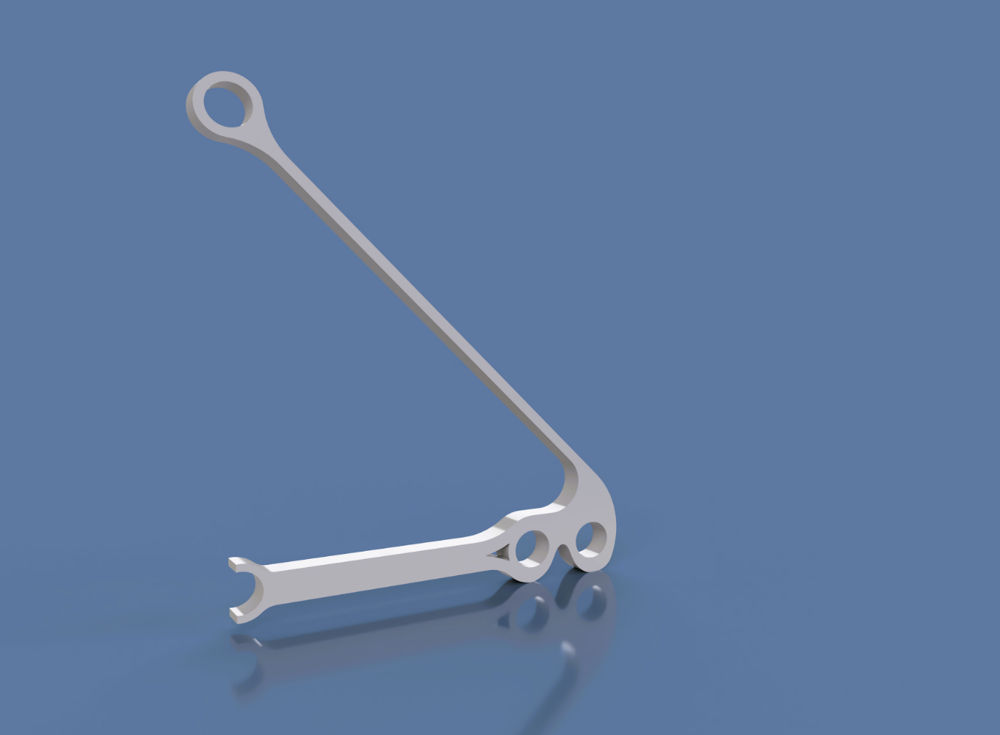
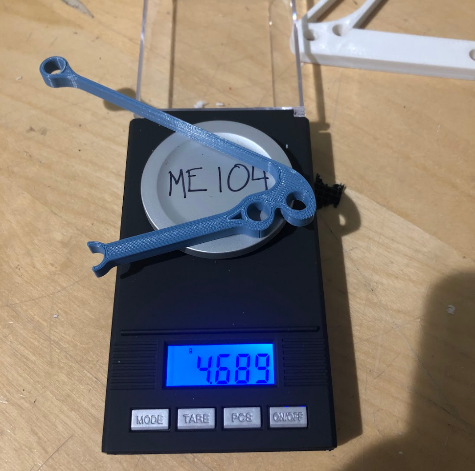
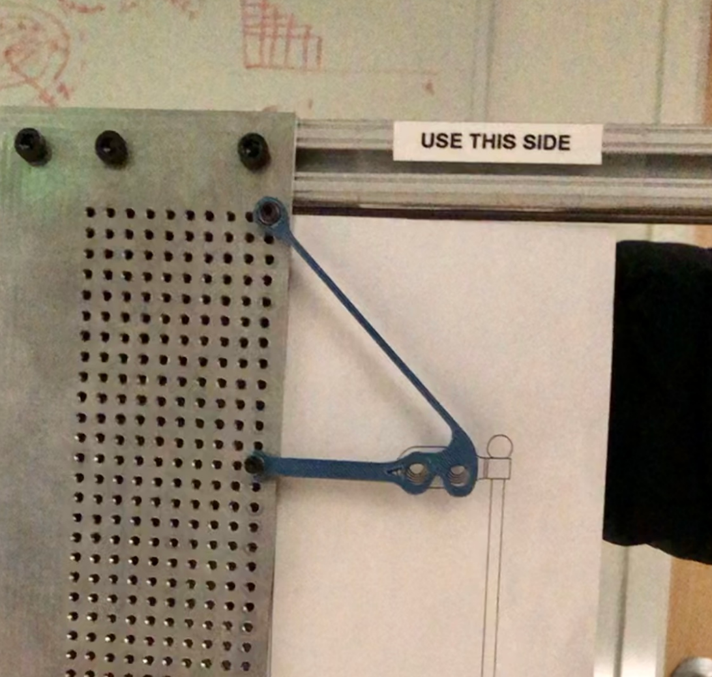
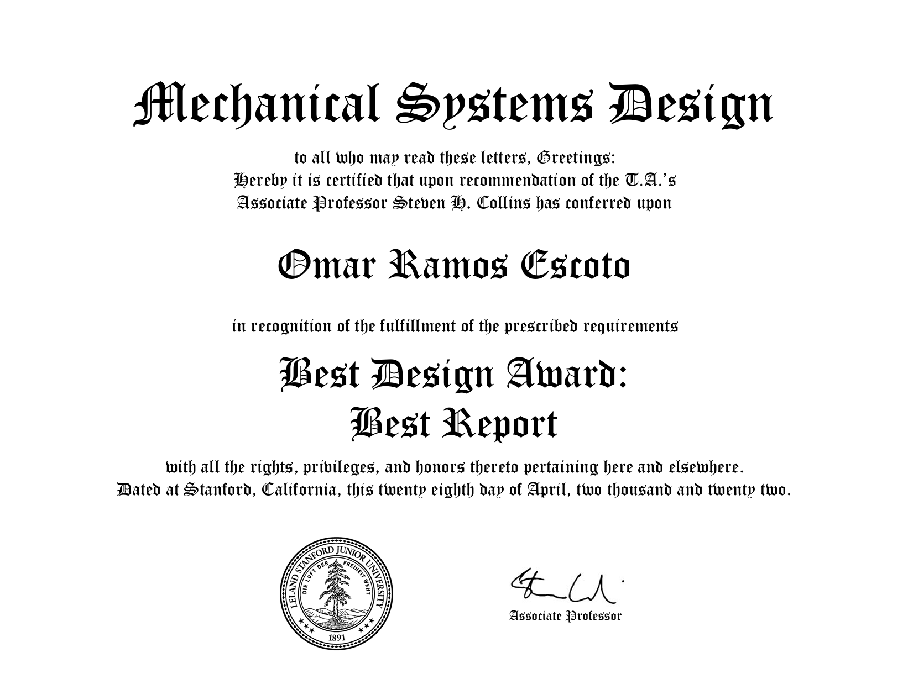
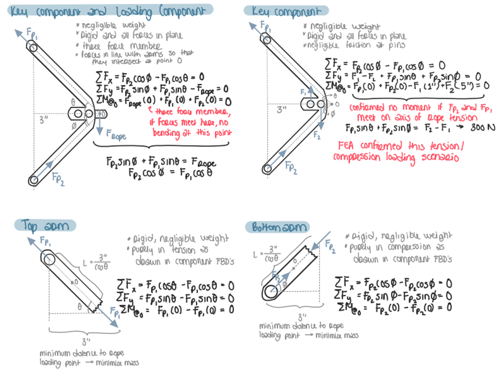
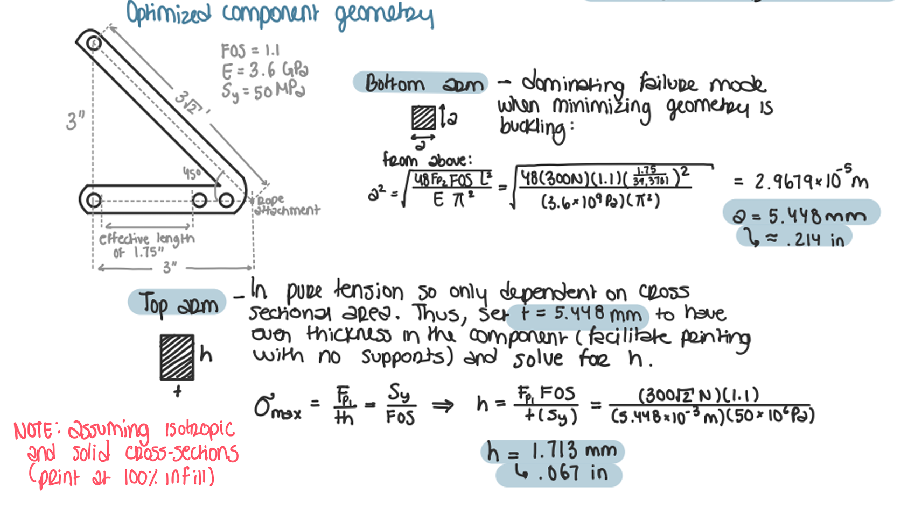
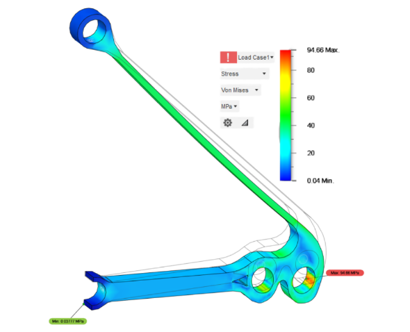
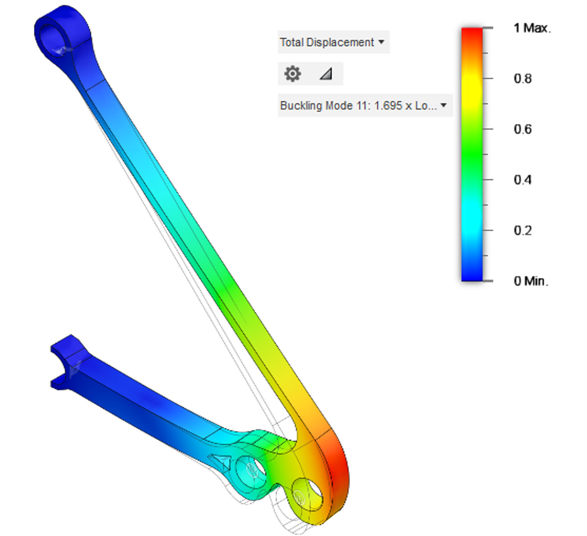

## 🚀 **Project Overview**  
- **Project Name:** Mass-Efficient Structural Component  
- **Role:** Mechanical Systems Designer  
- **Technologies:** Structural Optimization, FEA, CAD (Fusion 360), Buckling Analysis, Shape Optimization, Failure Analysis  
- **Class:** ME104: Mechanical Systems Design  
- **Duration:** ~2 weeks  
- **Key Contributions:** Mass Reduction, Failure Analysis, Structural Design  
- **Documentation:**  
  - 📄 <a href="../assets/docs/Project_1---Description.pdf" target="_blank" rel="noopener noreferrer">Project Description Handout</a>  
  - 📄 <a href="../assets/docs/Project1_Report.pdf" target="_blank" rel="noopener noreferrer">Final Report</a>  

  
  
  

### **Testing & Failure Video**  
This video shows the gradual loading of the component as I manually place weights onto the lever arm, increasing the force it exerts on the component. The design goal was to support a 300N force, but in testing, it failed at 400N, meaning the actual safety factor was slightly above 1. This was impressive but also suggests that even further optimization could be possible—in an ideal case, a safety factor of exactly 1 would mean perfect material efficiency for this project. However, practical constraints such as 3D printing limitations, real-world force approximations, and minor out-of-plane forces made it necessary to design slightly conservatively.  

  
  <iframe src="https://drive.google.com/file/d/1KLigwvxPhDurvMFG_A6PHprYGAKDw2F1/preview" width="640" height="480" allow="autoplay"></iframe>

 

---

## 🎯 **Project Objective & Constraints**  

This project challenged me to design *the lightest possible structural component* capable of supporting a 300N load while adhering to strict geometric and material constraints.  

**The key challenge:** Any oversized component could trivially support the load, but **the goal was to minimize mass while precisely distributing forces to just meet the required strength**—**achieving extreme mass efficiency**. This required:  
✔ **Deep understanding of force distribution** to avoid overdesigning any section.  
✔ **Strategic geometry selection** to align forces and eliminate unnecessary load paths.  
✔ **Failure analysis** to ensure that the component **failed exactly as predicted** at the lowest possible mass.  

**Constraints & Requirements:**  
✔ **Mass Efficiency:** Minimize weight while ensuring structural integrity.  
✔ **Geometric Constraints:** Must fit within a predefined support peg and loading component setup.  
✔ **Loading Conditions:** Handle up to 300N of force without failure.  
✔ **Material Limitation:** Must be 3D-printed in PLA.  
✔ **Failure Criteria:** Must withstand buckling and stress limits.  

🏆 **Results:**  
- **🏅 Awarded "Best Report"** for technical depth and clarity.  
- **⚖️ 2nd Lightest Design:** Component weight within *tenths of a gram* of the lightest entry.  

  

  <iframe src="../assets/docs/Project1_Report.pdf" 
          width="100%" 
          height="600px"></iframe>

---

## 🔧 **Technical Design Breakdown**  

### **1️⃣ Force Distribution & Structural Optimization**  
To **eliminate unnecessary bending moments** and ensure all load-bearing members carried pure axial loads, I designed a dual-arm structure:  
- **Top Arm (Tensile Member):** Placed at maximum allowable angle to distribute forces efficiently while keeping mass low.  
- **Bottom Arm (Compressive Member):** Placed horizontally and as short as possible to *minimize buckling risk*.  

This ensured that forces were aligned with the arms' principal axes, preventing bending moments and allowing for smaller, lighter cross-sections while maintaining strength.  

  
  

---

### **2️⃣ Failure Analysis & Safety Factor Validation**  
- **Back-of-the-Envelope Analysis (BOTEA):** Estimated expected stresses using free-body diagrams.  
- **Stress Concentration Analysis:** Identified high-stress regions and reinforced key areas.  
- **FEA Validation:** Verified stress distribution and ensured >3x safety factor in critical regions before experimental testing.  

  

---

### **3️⃣ Buckling Prevention & Structural Rigidity**  
- **Compression Arm Buckling Analysis:** Simulated first buckling mode to optimize stiffness-to-mass ratio.  
- **Cross-Sectional Design:** Used a solid square section to maximize moment of inertia with minimal material.  
- **Fusion 360 Simulation:** Validated design by comparing theoretical buckling loads with FEA results.  

  

---

## ⚙️ **Challenges & Solutions**  

- **❌ Balancing Mass Reduction & Structural Integrity**  
  - *Issue:* Removing too much material risked exceeding stress limits.  
  - ✅ *Solution:* Conducted iterative FEA + BOTEA to refine geometry while maintaining required safety factor.  

- **❌ Preventing Buckling in the Bottom Arm**  
  - *Issue:* The compression arm was susceptible to buckling under load.  
  - ✅ *Solution:* Used a shorter, thicker profile with a high moment of inertia to resist instability.  

- **❌ Ensuring Printability Without Supports**  
  - *Issue:* Complex geometry could introduce overhangs needing excess material for support.  
  - ✅ *Solution:* Optimized orientation to eliminate overhangs, ensuring a clean, efficient print.  

---

## 🎓 **Key Takeaways**  

✔ **Mass-efficient design requires careful force alignment** – Eliminating bending moments drastically improves strength-to-weight ratio.  
✔ **Structural optimization is an iterative process** – FEA + BOTEA helped refine designs while maintaining performance.  
✔ **Failure analysis is critical for lightweight structures** – Buckling and stress constraints drive material placement decisions.  
✔ **Every gram matters** – Minor refinements made tenths-of-a-gram differences in final component weight.  

---

## 🌟 **Final Thoughts**  

This project demonstrated the importance of structural efficiency and mass reduction in mechanical systems. By leveraging free-body analysis, failure theory, and computational validation, I developed a lightweight yet robust component that performed among the best in the class.  

---
