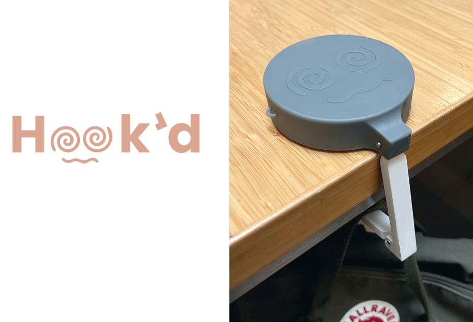

## 🚀 Project Overview  
- **Project Name:** Hooked: a Portable Folding Hook  
- **Role:** Designer & Fabricator  
- **Technologies:** SLA 3D Printing, Material Optimization, Structural Analysis (FEA), Press-Fit Assembly  
- **Class:** ME127: Design for Additive Manufacturing  
- **Duration:** ~2 weeks  
- **Key Contributions:** Material Selection, Structural Optimization, Manufacturing Constraints  
- **Team Members:** 3 members  
- **Documentation:**  
  - 📄 <a href="../assets/docs/ME127_Hooked.pdf" target="_blank" rel="noopener noreferrer">Final Report</a>  

  <iframe src="https://drive.google.com/file/d/1KJyLS_fk9S8BMfaryXboBL4l15gQ_JWq/preview" 
          frameborder="0" 
          width="800" 
          height="600"></iframe>

---

## 🎯 Project Objective & Constraints  

We designed a portable folding hook that can be mounted on flat surfaces with an overhang, allowing users to hang masks, bags, or keys in various locations.  

### Key Design Requirements  
✔ Folds into a compact form when not in use  
✔ Supports a 20-pound load without failure  
✔ Uses at least two different 3D printing materials to optimize performance  
✔ Incorporates press-fit joints and magnets for smooth operation  

🏆 **Results:**  
- Successfully held 20 lbs before experiencing minor plastic deformation  
- Optimized press-fit joints, allowing secure assembly without adhesives  
- Integrated the following Formlab's SLA printing resins: Rigid 10K for strength, Flexible 80A for grip, and Standard Gray for cost-efficiency 

---

## 🔧 Design & Iteration Process  

### 1️⃣ Concept Development & Initial Prototyping  
- Explored different hook geometries to balance strength, portability, and ease of use  
- Printed an initial prototype in PLA to validate form, dimensions, and stress distribution before switching to SLA  
- Identified that the bottom member experienced the most stress, guiding material selection  

  

---

### 2️⃣ Material Selection & Press-Fit Assembly  
- **Rigid 10K Resin** – Used for the main load-bearing hook to provide high strength and stiffness  
- **Flexible 80A Resin** – Applied to the contact surfaces to increase grip and prevent slippage  
- **Standard Gray Resin** – Chosen for the cylindrical housing to reduce cost while maintaining functionality  
- Press-fit joints and magnets enabled smooth operation without fasteners or adhesives  

  

---

### 3️⃣ Structural Analysis & Failure Prevention  
- Free-body diagrams identified the **critical stress points** under a 90N load  
- Inverse failure analysis determined the **minimum required thickness** to meet a safety factor of 2  
- **FEA Validation:**  
  - Simulated fixed pin constraints and 90N load in Fusion360  
  - Identified the highest stress concentrations near the pin joints  
  - Increased material around pins after the **first failure at 10 lbs**  

  

---

## ⚙️ Challenges & Solutions  

- **Initial Failure at 10 lbs**  
  - *Issue:* First print broke at the pins due to underestimated stress concentrations  
  - ✅ *Solution:* Increased material around the pins and re-ran simulations to confirm improved load capacity  

- **Press-Fit & Tolerance Issues**  
  - *Issue:* First prototypes didn’t fit properly due to resin shrinkage variability  
  - ✅ *Solution:* Performed tolerance test prints for different materials and adjusted hole diameters accordingly  

- **Flexible Material Stability**  
  - *Issue:* Soft surfaces deformed too much, reducing stability  
  - ✅ *Solution:* Used grooves and press-fit locking features to keep components in place  

---

## 🖼️ Gallery  

### Final Hook Design & Assembly  

  
  
  

  

---

## 🎓 Key Takeaways  

✔ Multi-material design requires careful material selection for structural optimization  
✔ Press-fit tolerancing is critical in SLA 3D printing—resins shrink inconsistently, requiring test prints and adjustments  
✔ Simulations and real-world testing work best together—FEA provided a strong starting point, but physical testing was needed for validation  
✔ Design for manufacturability saves time—optimizing print orientation helped preserve tolerances and improve surface finish  

---

## 🌟 Final Thoughts  

This project combined material science, mechanical design, and simulation-driven optimization. Designing for **multi-material SLA 3D printing** was a valuable experience, particularly in understanding **press-fit tolerances, structural limitations, and manufacturability constraints**.  

---
