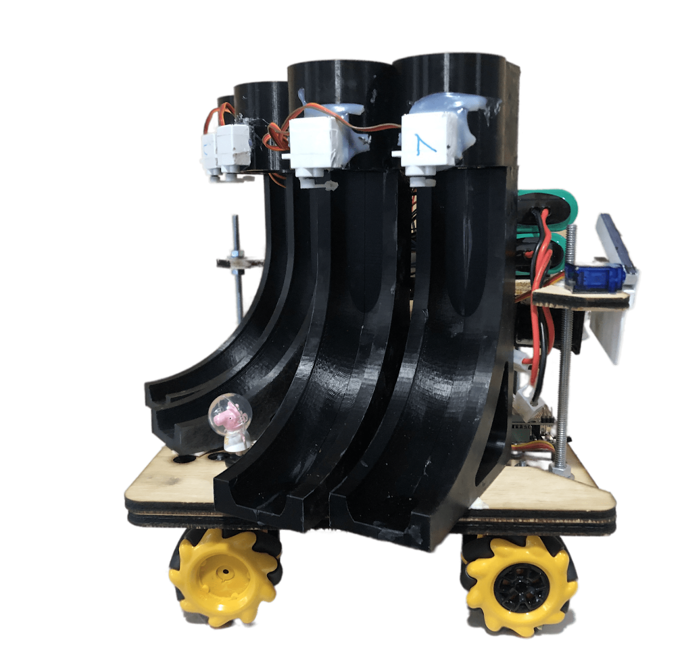
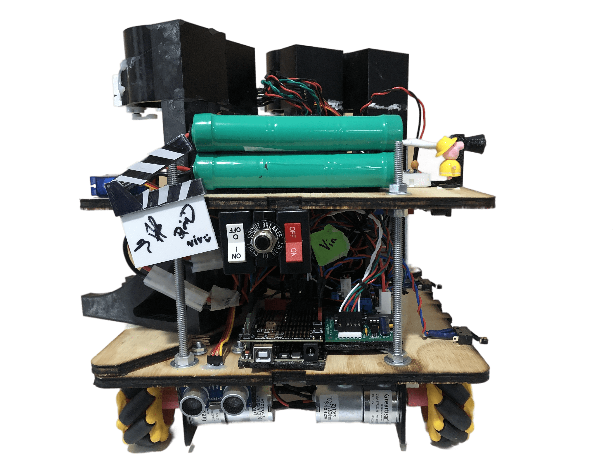
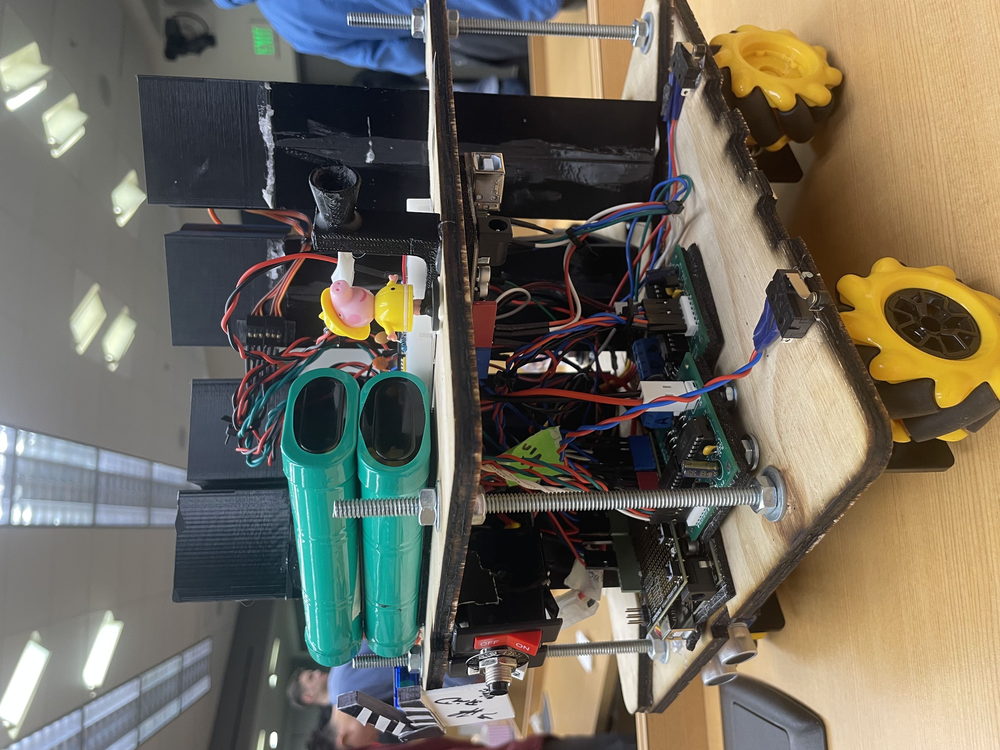
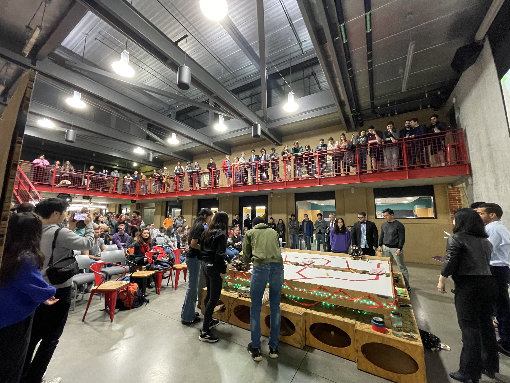
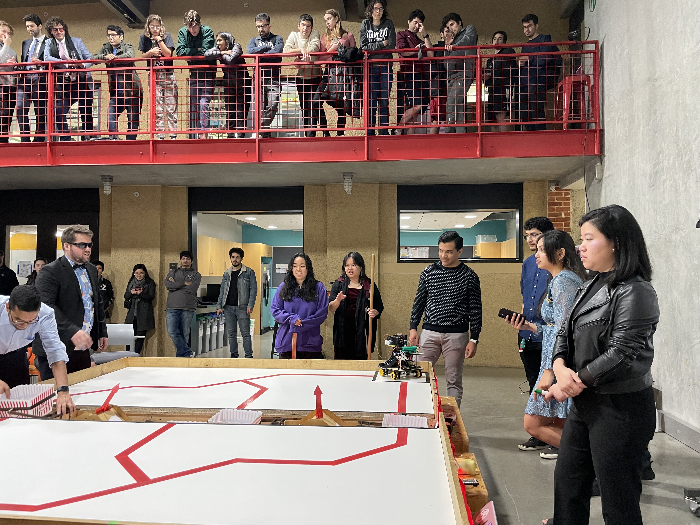
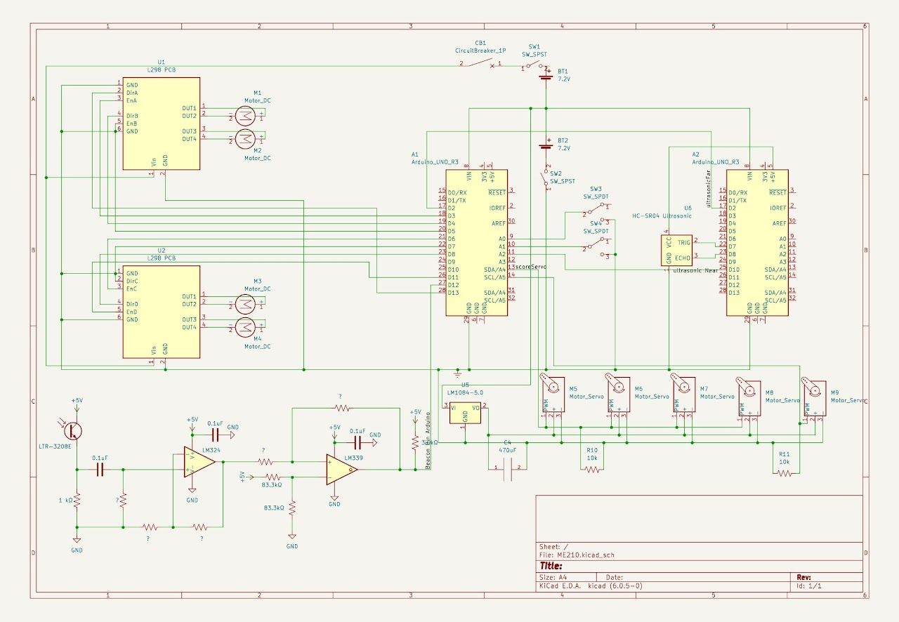
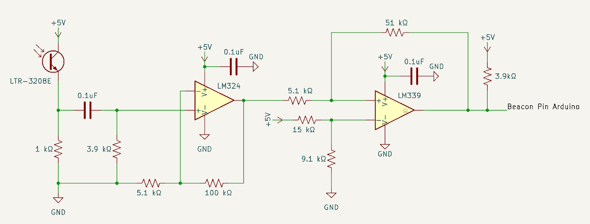
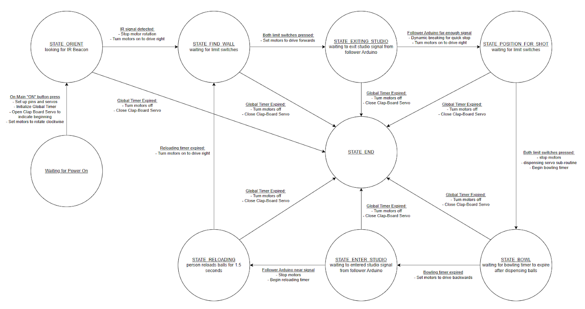

## 🚀 **Project Overview**  
- **Project Name:** The Big Robowski  
- **Role:** Embedded Systems & Integration Lead  
- **Technologies:** C++, Arduino, FSMs, IR Beacon Detection, Ultrasonic Sensing, Mecanum Wheels, Servos  
- **Class:** ME210: Introduction to Mechatronics  
- **Team Size:** 4 members  
- **Duration:** ~3 weeks  
- **Key Contributions:** IR Beacon Circuit Design, Software Development, System Integration & Calibration  
- **🎥 Demo:**  

  
  <iframe src="https://drive.google.com/file/d/1GwEzH1EEjeklagSo2PLMwOActZVRriIb/preview" width="640" height="480" allow="autoplay"></iframe> 

  
---

## 📖 **Project Summary**  

The **Big Robowski** was an autonomous competition robot that competed in a head-to-head game delivering "good" and "bad" press to scoring buckets. The robot had to **navigate, align, and dispense balls with precision** in a 2-minute 10-second match.  

Our strategy focused on:  
✔ *Fast cycle times* – Rapid navigation and scoring.  
✔ *Reliable IR beacon tracking* – Ensuring accurate field positioning.  
✔ *Mecanum wheels* – Enabling omnidirectional movement and realignment.  
✔ *Robust state machine* – Minimizing transition delays and maximizing scoring opportunities.  

---

## 🛠️ **Key Technologies & Concepts**  

- **IR Beacon Tracking:** Custom 3-stage circuit with *high-pass filtering, op-amp amplification, and Schmitt trigger logic* for precise detection.  
- **Finite State Machines (FSMs):** Modular, testable states for *navigation, scoring, and reloading*.  
- **Mecanum Wheel Drive System:** Allowed lateral repositioning and precise wall alignment.  
- **Ultrasonic Sensing:** External Arduino handled filtering to improve accuracy.  
- **Limit Switch-Based Homing:** Ensured repeatable positioning before each scoring attempt.  
- **Servo-Controlled Ball Dispensing:** Optimized timing for consistent releases.  
- **Arduino C++ Development:** Implemented *sensor fusion, motor control, and scoring logic*.  

---

## 👤 **My Role & Key Contributions**  

- **IR Beacon System:** Designed a *custom IR detection circuit* with *noise filtering and gain tuning* to ensure reliable field localization.  
- **Full Software Development:** Implemented the entire FSM and motor control system in C++ for Arduino.  
- **System Integration & Calibration:** Developed precise homing routines using limit switches and ultrasonic sensors.  
- **Mecanum Wheel Control & Tuning:** Optimized motion to achieve repeatable positioning before scoring.  
- **Ultrasonic Sensor Filtering:** Offloaded distance sampling to a secondary Arduino, reducing blocking delays.  
- **Testing & Optimization:** Experimented with ball release angles, servo timings, and sensor thresholds for improved accuracy.  

---

## 🚩 **Challenges & Solutions**  

- **Reliable IR Beacon Detection:**  
  - *Issue:* Ambient light interference caused false readings.  
  - *Solution:* *High-pass filtering* removed noise; *op-amp gain* optimized detection range.  

- **Accurate Ball Dispensing Without Active Aiming:**  
  - *Issue:* Needed to release balls into static buckets while moving.  
  - *Solution:* Pre-aligned bowling tubes with servo-controlled release ensured consistency.  

- **Homing & Resetting Position Between Cycles:**  
  - *Issue:* Needed precise alignment for repeatable shots.  
  - *Solution:* Limit switches ensured re-alignment before each cycle.  

- **Non-Blocking Ultrasonic Sensing:**  
  - *Issue:* Sampling the sensor too often caused unstable readings and blocking.  
  - *Solution:* Secondary Arduino handled filtering and threshold detection.  

---

## 🧰 **Technical Stack & Testing**  

- **Development:** Arduino (C++)  
- **Motion Control:** Mecanum Wheels, PWM-based speed control  
- **State Machine Design:** FSM using structured switch-case logic  
- **Sensors:** IR beacon detector, ultrasonic sensors, limit switches  
- **Circuit Design Tools:** LTspice for IR signal filtering & gain tuning  
- **Testing:** Oscilloscope, Serial Monitor for debugging state transitions  

---

## 🌟 **Project Highlights**  

✔ **Custom IR beacon circuit** for precise localization  
✔ **State machine-driven control** for reliable navigation  
✔ **Mecanum wheels enabled omnidirectional movement**  
✔ **Limit switch homing for repeatable alignment**  
✔ **Secondary Arduino optimized ultrasonic sensor performance**  

---

## 💡 **Lessons Learned**  

- **IR circuits require careful signal conditioning** to filter ambient interference.  
- **Mecanum wheels** provide great flexibility but require precise motion control tuning.  
- **Reliable homing mechanisms** (limit switches & ultrasonic sensing) are essential for repeatability.  
- **A well-structured state machine simplifies debugging** and improves performance.  

---

## 📸 **Gallery**  

- **The Big Robowski in Action:**  

  
  <iframe src="https://drive.google.com/file/d/1GwEzH1EEjeklagSo2PLMwOActZVRriIb/preview" width="640" height="480" allow="autoplay"></iframe> 

  

- **Assembly Views:**  

  
  
  

- **Competition Views:**  

  
  

- **Schematics:**  

  
  

- **State Machine Diagram:**  

  

---

## 📂 **Project Documentation**  
- 📄 <a href="../assets/docs/ME210_W23_Project.pdf" target="_blank" rel="noopener noreferrer">Project Handout (PDF)</a>  
- 🌐 <a href="https://sites.google.com/stanford.edu/the-big-robowski/home" target="_blank" rel="noopener noreferrer">Project Website</a>  
- 🔗 <a href="https://sites.google.com/stanford.edu/the-big-robowski/software" target="_blank" rel="noopener noreferrer">Source Code</a>  