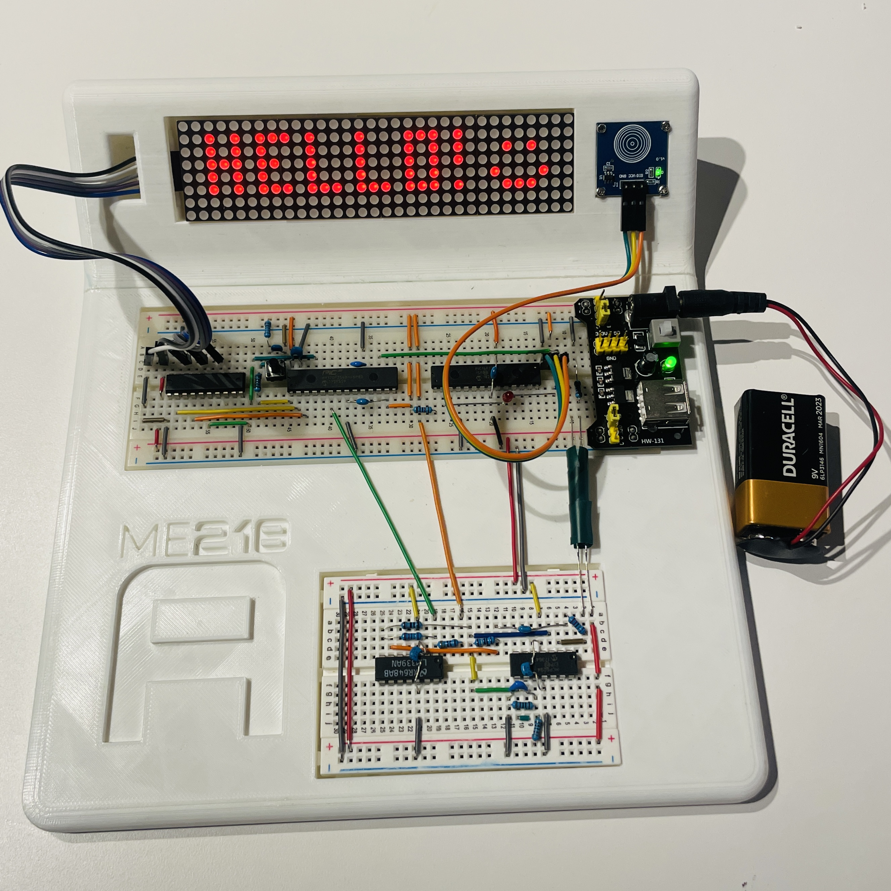
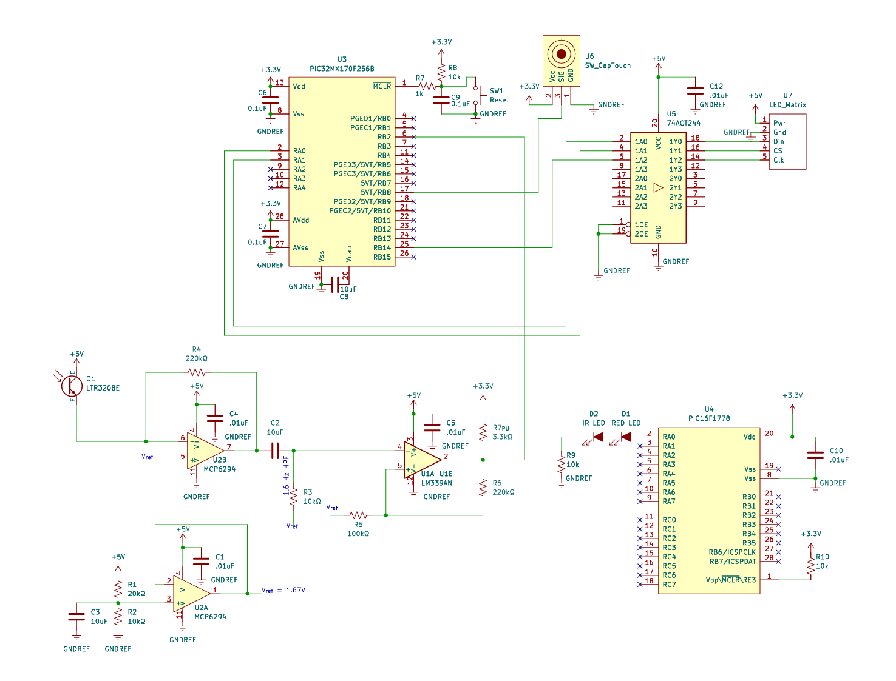

## 🚀 **Project Overview**  
- **Project Name:** Morse Code Decoder  
- **Technologies:** Embedded C/C++, FSMs, SPI, UART, PIC32, MAX7219 LED Matrix, IR Phototransistor, Capacitive Touch  
- **Class:** ME218A: Smart Product Design Fundamentals  
- **Key Focus:** FSM Design, Signal Processing, Embedded Software & Hardware Integration  

  

---

## 📖 **Project Description**  

This real-time **Morse Code decoder** detects IR pulses, processes them via a **finite state machine (FSM)**, and scrolls decoded characters across an **LED matrix display**.  

🔹 **Key Features:**  
✔ **IR Signal Processing:** Phototransistor-based detection circuit.  
✔ **FSM-Based Decoding:** Recognizes dots, dashes, and pauses for Morse translation.  
✔ **Modular Software Design:** Independent **Morse processing, button input, display control**.  
✔ **Self-Calibrating Input Handling:** Adapts dynamically to different Morse Code speeds.  
✔ **SPI-Controlled LED Matrix:** Displays characters using a custom **Hardware Abstraction Layer (HAL)**.  
✔ **Neat Breadboard Design:** Clean circuit layout for easy debugging.  

---

## 🛠️ **Key Technologies & Concepts**  

- **Infrared Signal Processing:** IR phototransistor circuit for Morse input detection.  
- **Finite State Machines (FSMs):** Decodes Morse Code timing and transitions states accordingly.  
- **SPI Communication:** Controls the **MAX7219 LED matrix** for scrolling text output.  
- **Event-Driven Architecture:** Main module manages communication with independent subsystems:  
  - **Button Input (Capacitive Touch)** – Handles calibration/reset.  
  - **Morse Signal Processing** – Detects and decodes Morse input.  
  - **Display Module (SPI HAL)** – Scrolls output text onto the LED matrix.  

---

## 🚩 **Key Challenges & Solutions**  

- **🔍 IR Signal Noise & Inconsistent Detection**  
  - *Solution:* Implemented **hysteresis filtering** & real-time **threshold calibration**.  

- **🔄 Adapting to Different Morse Code Speeds**  
  - *Solution:* Developed a **self-calibrating FSM** that adjusts timing thresholds dynamically.  

- **⚡ Preventing Messy Breadboarding & Debugging Issues**  
  - *Solution:* Followed **best practices** in power distribution, signal separation, and labeled wiring.  

- **🔗 Maintaining Software Modularity**  
  - *Solution:* Ensured **strict module separation**, preventing direct inter-module communication.  

---

## 🧰 **Technical Stack & Validation**  

- **Microcontroller:** PIC32MX170F256B  
- **Firmware:** Embedded C (MPLAB X, XC32 Compiler)  
- **Communication:**  
  - **SPI** – Drives MAX7219 LED matrix  
  - **UART** – Debugging output via serial  
- **Key Hardware Components:**  
  - **Infrared Sensor:** Phototransistor-based detection  
  - **Display:** MAX7219 8x32 LED Matrix  
  - **Signal Conditioning:** 74ACT244 Octal Buffer (3.3V ↔ 5V)  
  - **User Input:** Capacitive touch button for calibration/reset  
- **Mechanical Design:** Custom **Fusion 360** breadboard enclosure  
- **Testing Tools:** Oscilloscope, Logic Analyzer, UART Terminal  

---

## 📸 **Gallery**  

- **Final System Layout:**  

  

- **Circuit Schematics:**  

  

---

## 🌟 **Project Highlights**  

✔ **Real-Time Morse Code Translation** via FSM-based signal processing.  
✔ **Self-Calibrating Input Handling** for adaptive Morse Code decoding.  
✔ **Modular Embedded System** with clear separation of processing & display logic.  
✔ **Organized Breadboard Circuit** designed for ease of debugging & maintenance.  
