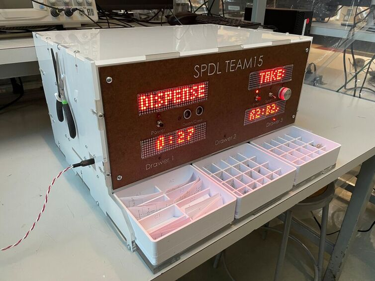

## 🚀 **Project Overview**  
- **Project Name:** Smart Portable Electronics Design Locker (SPDL)  
- **Role:** Embedded Systems & Integration Lead  
- **Technologies:** Embedded C/C++, FSMs, SPI, PIC32, KiCad, MPLAB X  
- **Class:** ME218A: Smart Product Design Fundamentals (Graduate-Level Mechatronics Series)  
- **Team Size:** 3 members  
- **Duration:** ~3 weeks  
- **Key Contributions:** FSM Design and Software Implementation, SPI Driver Development, System Reliability, Mechanical Design Input  
- **Documentation:** <a href="https://me218a-smartportableelectronicsdesignlab.weebly.com/" target="_blank" rel="noopener noreferrer">Project Website</a>  
- **🎥 Demo:**  

  
  <iframe src="https://www.youtube.com/embed/8TC3ehUtTb4" frameborder="0" allowfullscreen></iframe>  

  

---

## 📖 **Project Summary**  

The Smart Portable Electronics Design Locker (SPDL) automates and accelerates analog circuit prototyping by eliminating manual calculations and component selection errors. By dynamically generating schematics, optimizing part selection, and automating circuit validation, SPDL simplifies circuit design for mechatronics and signal processing applications.

---

## 🛠️ **Key Technologies & Concepts**  
- Embedded C/C++  
- Event-Driven Finite State Machines (FSMs) for Modular, Real-Time Control using UML Design  
- SPI Communication Protocol Implementation  
- Analog Sensors & Actuators  
- Real-Time Interrupt Handling & Event-Driven Programming  
- Microcontroller Programming (PIC32)  
- Numerical Stability in Embedded Systems  
- Signal Denoising & Noise Reduction Techniques  
- Embedded Systems Architecture & Hardware-Software Co-Design  
- Power Management in Embedded Devices
- Low-Level Driver & Peripheral Interface Development

---

## 👤 **My Role & Key Contributions**

- **Embedded Systems & Integration Lead:** Designed modular, event-driven FSMs for robust, real-time system behavior and led system-level integration across hardware and software components.  
- **SPI Communication & Multi-Device Display Control:** Developed low-level SPI drivers to handle multiple LED arrays on a shared bus, optimizing buffer synchronization and reducing flickering.
- **System Reliability:** Engineered robust boot/recovery protocols for resilience against resets and power fluctuations.
- **Numerical Optimization:** Improved calculation accuracy using fixed-point arithmetic for embedded systems with limited floating-point support.  
- **Cross-Disciplinary Impact:** Contributed to mechanical design ideation (CD-drive-based dispensing system) and electrical troubleshooting (signal denoising, noise reduction strategies).  

---

## 🚩 **Key Challenges & Solutions**

- **SPI Communication for Multiple Displays:**  
  - *Challenge:* Managing dynamic content over a single SPI line.  
  - *Solution:* Optimized buffer control with lookup tables and advanced bit masking, improving data sync and reducing flickering.  

- **Floating-Point Limitations of PIC32:**  
  - *Challenge:* Inaccurate calculations due to limited floating-point support.  
  - *Solution:* Implemented fixed-point arithmetic, enhancing computational efficiency and accuracy.  

- **FSM Reset Integrity:**  
  - *Challenge:* Ensuring reliable resets after timeouts or power cycles.  
  - *Solution:* Designed fail-safe state-reset protocols to maintain system integrity after power cycles or unexpected resets, ensuring continuous operation without manual intervention.

- **Mechanical Design for Reliable Dispensing:**  
  - *Challenge:* Designing a compact, reliable dispensing mechanism with sufficient throw. 
  - *Solution:* Proposed a lead screw-based system with limit switches, repurposing CD drive components for precision and ease of integration.  

- **Display Noise & Flickering:**  
  - *Challenge:* Diagnosing and mitigating SPI communication-induced noise.  
  - *Solution:* Implemented near-source denoising techniques, optimized signal grounding, and reduced interference through improved layout considerations. 

---

## 🧰 **Technical Stack & Validation**

- **Microcontroller Development:** PIC32 with MPLAB X IDE  
- **Version Control:** Bitbucket & Git  
- **Hardware Design Tools:** KiCad for schematics, PCB layout  
- **Signal Analysis Tools:** Oscilloscope & Saleae Logic Analyzer  
- **Documentation:** Weebly for project website  
- **Technical References:** Extensive use of PIC32 datasheets/manuals for SPI configuration  

**Testing & Validation:**  
- **Signal Analysis:** Analyzed SPI signals with oscilloscopes and Saleae Logic Analyzer  
- **FSM Verification:** Verified FSM transitions under real-time conditions  
- **System Integration Testing:** Conducted end-to-end system validation  
- **Analog Debugging:** Debugged analog signals for noise issues and stability  

---

## 🌟 **Project Highlights**
- **Architected Robust Embedded Systems:** Designed modular FSMs with real-time interrupt handling for seamless hardware-software integration.
- **Optimized Data-Driven Hardware Control:** Enhanced SPI communication efficiency and LED display management through advanced buffer control, real-time data synchronization, and noise mitigation strategies.
- **Cross-Disciplinary Problem Solving:** Contributed to mechanical design ideation and electrical troubleshooting, demonstrating cross-disciplinary versatility in mechatronics.

---

## 💡 **Reflection & Lessons Learned**

Working on SPDL deepened my expertise in embedded systems, particularly FSM design, real-time data processing, and SPI communication. I gained hands-on experience with hardware-software integration, signal debugging, and system reliability. Leading the software architecture reinforced the importance of modular, maintainable code, while my contributions to mechanical and electrical problem-solving highlighted the value of cross-disciplinary thinking in mechatronics.

---

## 📸 **Gallery**

- **SPDL in Action:** Demonstrating real-time circuit guidance and component dispensing.  

  <iframe src="https://www.youtube.com/embed/8TC3ehUtTb4" frameborder="0" allowfullscreen></iframe>

- **Main Finite State Machine:**  

  

- **Assembly:**  

  

---

## 📂 **Project Documentation**
- 📄 <a href="../assets/docs/ME218a_F23_Project_Spec_Rev3.pdf" target="_blank" rel="noopener noreferrer">Project Handout (PDF)</a>
- 🌐 <a href="https://me218a-smartportableelectronicsdesignlab.weebly.com/" target="_blank" rel="noopener noreferrer">Project Website</a>
- 🔗 <a href="https://me218a-smartportableelectronicsdesignlab.weebly.com/software.html" target="_blank" rel="noopener noreferrer">Source Code</a>

