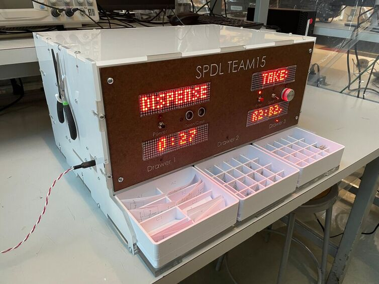

# [Smart Portable Electronics Design Locker (SPDL)](https://me218a-smartportableelectronicsdesignlab.weebly.com/)

The Smart Portable Electronics Design Locker (SPDL) is a smart product designed to simplify analog circuit design for common applications in mechatronics and signal processing. SPDL automates the creation of eight fundamental circuits, including Op-Amp and comparator configurations. Users select their desired circuit type, input basic parameters, and SPDL handles the rest—calculating required values, displaying detailed schematics, and guiding the user to the exact components needed. This eliminates the need for complex calculations and time-consuming component sourcing, making circuit design more efficient and accessible.

See the full [Project Website here](https://me218a-smartportableelectronicsdesignlab.weebly.com/)!

## 🎥 **Demo**

  <iframe width="560" height="315" src="https://www.youtube.com/embed/8TC3ehUtTb4" frameborder="0" allowfullscreen></iframe>

---

## 🛠️ **Key Technologies & Concepts**
- Embedded C/C++
- Finite State Machines (FSMs) using UML design
- SPI Communication Protocol Implementation
- Analog Sensors & Actuators
- Real-Time Interrupt Handling
- Microcontroller Programming (PIC32)
- Numerical Stability in Embedded Systems
- Signal Denoising & Noise Reduction Techniques

---

## 👤 **My Role & Contributions**
- **Software Lead:** Designed and implemented all FSMs, orchestrating seamless system behavior through modular, event-driven code architecture.
- **SPI Communication & Display Control:** Developed drivers for LED arrays connected via a single SPI line, managing buffers, synchronization, and dynamic/static content transitions using bit masking techniques.
- **System Reliability:** Implemented safe booting and rebooting mechanisms across all FSMs, ensuring robust recovery from timeouts and unexpected resets.
- **Numerical Optimization:** Addressed numerical stability challenges for 32-bit float operations, optimizing calculations for resistor and component selection using efficient lookup tables and fixed-point arithmetic.
- **Electrical Contributions:** Contributed to troubleshooting signal noise issues in SPI communication, identifying sources of display flickering, and proposing denoising strategies close to the data source for improved stability and user experience.
- **Mechanical Contributions:** Collaborated in brainstorming mechanical solutions, particularly around refining the dispensing mechanism, transitioning from an initial lead screw motor prototype to a more reliable drawer-based design.

---

## 🚩 **Challenges & Solutions**
- **Challenge:** SPI Communication for Multiple Displays: Managing dynamic content over a single SPI line.  
  - **Solution:** Implemented advanced buffer control, optimized lookup tables, and precise bit masking to synchronize multiple LED displays. Enhanced robustness through fine-tuned baud rate adjustments and error-checking mechanisms.

- **Challenge:** Addressing floating-point limitations of the PIC32 microcontroller.  
  - **Solution:** Applied principles of numerical stability, utilizing efficient lookup tables and optimized fixed-point arithmetic to ensure accurate, reliable calculations.

- **Challenge:** Ensuring all FSMs reset appropriately after system timeouts.  
  - **Solution:** Engineered comprehensive state reset protocols, maintaining system integrity and seamless operation across all interacting modules.

- **Challenge:** Display Noise and Flickering Issues.  
  - **Solution:** Diagnosed noise interference in SPI communication, proposing signal denoising techniques near the data source to stabilize display output and eliminate flickering.

- **Challenge:** Mechanical Design Inefficiencies in the Initial Prototype.  
  - **Solution:** Contributed to the redesign of the dispensing mechanism, transitioning from a lead screw motor concept to a drawer-based system, improving reliability and ease of assembly.

---

## 🌟 **Project Highlights**
- **Architected Robust Embedded Systems:** Designed and implemented complex, modular FSMs with real-time interrupt handling, ensuring seamless integration of hardware and software components.
- **Optimized Data-Driven Hardware Control:** Enhanced SPI communication efficiency and LED display management through advanced buffer control, real-time data synchronization, and noise mitigation strategies.
- **Cross-Disciplinary Problem Solving:** Provided impactful contributions beyond software, including mechanical design ideation and electrical troubleshooting, showcasing versatility in mechatronics projects.

---

## 📸 **Gallery**

- **SPDL in Action:** Demonstrating real-time circuit guidance and component dispensing.  

  <iframe width="560" height="315" src="https://www.youtube.com/embed/8TC3ehUtTb4" frameborder="0" allowfullscreen></iframe>

- **Main Finite State Machine:**  

- **Assembly**  

---

## 📂 **Project Documentation**
- 📄 [Project Handout (PDF)](../assets/docs/ME218a_F23_Project_Spec_Rev3.pdf)
- 🌐 [Project Website](https://me218a-smartportableelectronicsdesignlab.weebly.com/)

---

## 💡 **Reflection & Lessons Learned**

Working on SPDL deepened my expertise in embedded systems, particularly in FSM design, real-time data processing, and SPI communication. The project challenged me to consider system-wide stability, from managing hardware interfaces to ensuring numerical accuracy in calculations. Leading the software architecture reinforced the value of modular, maintainable code, while contributing to mechanical and electrical problem-solving highlighted the importance of cross-disciplinary thinking in mechatronics development.

---
