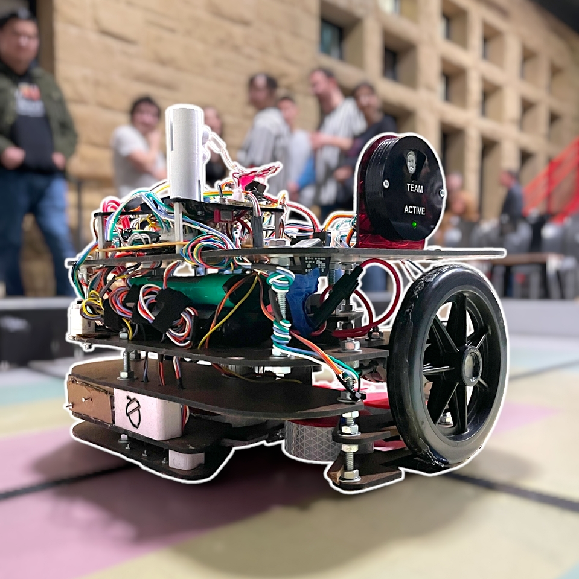

## 🚀 **Project Overview**  
- **Project Name:** System for Quick Removal of Litter (SQRL) - *Nuttin' Special*  
- **Role:** Embedded Systems & Integration Lead  
- **Technologies:** Embedded C/C++, FSMs, HSMs, SPI, UART, PID Control, PIC32, KiCad, MPLAB X, CAD  
- **Class:** ME218B: Smart Product Design Applications (Graduate-Level Mechatronics Series)  
- **Team Size:** 3 members  
- **Duration:** ~3 weeks  
- **Key Contributions:** Full Software Development, System Integration, Control Algorithms, Mechanical & Electrical Design Input  
- **Competition:** Finalist
- **Documentation:** <a href="https://nuttinspecial.weebly.com/" target="_blank" rel="noopener noreferrer">Project Website</a>  

  

---

# System for Quick Removal of Litter (SQRL) - *Nuttin' Special*

*Nuttin' Special* is an autonomous mobile robot designed to dominate the 2024 HOA Most Beautiful Lawn awards. Tasked with transporting ACORNs (*A Cylindrical Object Representing a Nut*), the robot leverages advanced beacon detection, precise line-following algorithms, and robust control systems to outmaneuver the competition. Its dual PIC32 microcontroller architecture, driven by SPI communication and hierarchical state machines (HSMs), ensures real-time decision-making and precision movement powered by finely tuned PID control loops.  

---

## 🛠️ **Key Technologies & Concepts**  
- Embedded C/C++  
- Hierarchical State Machines (HSMs) & Finite State Machines (FSMs)  
- SPI Communication Protocol (Leader-Follower Architecture)  
- UART Communication (Debugging, Data Logging with Tera Term)  
- Real-Time Interrupt Handling & Event-Driven Programming  
- PID Control for Precision Motor Control  
- Dual Microcontroller System (PIC32 Leader & Follower)  
- Digital Signal Processing (Moving Average Filters for Sensor Noise Reduction)  
- Line Following Algorithms (Reflective Sensor Calibration & Noise Mitigation)  
- Embedded Systems Architecture & Hardware-Software Co-Design  
- Resource-Constrained System Optimization (Maximized Timers/PWM Channels)  
- Low-Level Driver Development (Motors, Servos, Sensors)  
- System Integration Testing & Debugging with KiCad and CAD-Based Prototyping  
- Direct Stepper Motor Control (full-step through an H-bridge (SN754410))

---

## 👤 **My Role & Key Contributions**

- **Full Software Development:** Designed and implemented the complete embedded software stack, including HSMs, FSMs, SPI communication, UART debugging, and PID control algorithms.  
- **Embedded Systems & Integration Lead:** Led hardware-software integration, ensuring seamless coordination between mechanical, electrical, and software components.  
- **Autonomous Navigation & Control:** Developed localization strategies using IR beacon detection, line-following algorithms, and real-time encoder feedback.  
- **Sensor Noise Reduction:** Enhanced line-following reliability through digital filtering (moving average filters) combined with mechanical optimizations.  
- **Mechanical Design Impact:**  
  - Engineered servo-based ACORN positioning (*increased shooting consistency by ~50%*)  
  - Optimized limit switch placement (*improved tree-parking accuracy from 70% to 95%*)  
  - Designed 3D-printed spacers for consistent light sensor alignment  
- **Electrical System Optimization:**  
  - Suggested gain resistor adjustments for beacon sensing (*boosted localization success from 75% to 100%*)  
  - Configured servo multiplexing to maximize limited microcontroller resources  
- **Strategic Architecture Design:** Pioneered the use of a dedicated follower PIC for centralized motor control, enabling advanced PID algorithms for straight-line driving.  
- **Technical Documentation:** Created and maintained project documentation, including the project website, system architecture diagrams, and technical logs.  
- **Competition Achievement:** Led the team to the **final round** of the competition, outperforming most competitors with a robust, reliability-driven strategy.  

---

## 🚩 **Key Challenges & Solutions**

- **Real-Time Motor Control with Limited Resources:**  
  - *Challenge:* Managing multiple motors, servos, and sensors with constrained timers and PWM channels.  
  - *Solution:* Designed a dual-PIC architecture with optimized resource allocation, including shared PWM lines and centralized PID control.  

- **Sensor Noise Impacting Line Following:**  
  - *Challenge:* Noisy reflectance sensor data causing unreliable tape detection.  
  - *Solution:* Applied digital moving average filters and adjusted mechanical sensor placement with custom 3D-printed spacers for consistent performance.  

- **Inconsistent ACORN Shooting Accuracy:**  
  - *Challenge:* Pucks getting stuck and inconsistent shooting distances (~50% failure rate).  
  - *Solution:* Developed a servo-driven positioning mechanism (*increased consistency by ~50%* and eliminated jams).  

- **Unreliable Tree-Parking Detection:**  
  - *Challenge:* Inconsistent limit switch triggering, affecting parking under ACORN trees.  
  - *Solution:* Optimized limit switch placement and enhanced FSM logic for automatic re-alignment (*improved accuracy from 70% to 95%*).  

- **Localization Errors with Beacon Detection:**  
  - *Challenge:* IR beacon sensing inaccuracies, reducing localization success to 75%.  
  - *Solution:* Diagnosed circuit gain issues and recommended resistor adjustments (*achieved 100% localization accuracy*).  

- **Manual Stepper Motor Drive Implementation:**  
  - *Challenge:* Controlling a stepper motor without a driver board, requiring precise manual step sequencing.  
  - *Solution:* Designed a software-driven stepper control method, directly toggling H-bridge outputs to energize the correct coils for movement.

- **Fine-Tuned PID Control for Encoder-Based Motors:**  
  - *Challenge:* Achieving smooth and precise robot movement through closed-loop control.  
  - *Solution:* Experimentally tuned PID gains using real-world robot behavior, optimizing responsiveness and straight-line driving accuracy.

---

## 🧰 **Technical Stack & Validation**

- **Microcontroller Development:** PIC32 with MPLAB X IDE  
- **Version Control:** Bitbucket & Git  
- **Hardware Design Tools:** KiCad (PCB verification, connection testing)  
- **3D CAD Tools:** Prototyping for spacers and sensor mounts  
- **Signal Analysis Tools:** Oscilloscope & Saleae Logic Analyzer  
- **Debugging Tools:** UART with Tera Term for system testing and real-time logging  
- **Technical References:** Extensive use of PIC32 datasheets/manuals for SPI, PWM, and peripheral configuration  

**Testing & Validation:**  
- **Systematic Debugging:** Real-time debugging and sensor calibration using UART logs  
- **Signal Analysis:** SPI communication and PWM signal validation with oscilloscopes and logic analyzers  
- **FSM & HSM Testing:** Isolated state machine testing via UART-triggered events  
- **Integration Testing:** End-to-end system validation under competition conditions  

---

## 🌟 **Project Highlights**
- **Full-Stack Embedded Development:** Led the software design from low-level drivers to high-level decision-making architectures.  
- **Precision Control Algorithms:** Developed PID control loops for accurate, straight-line driving.  
- **Cross-Disciplinary Engineering:** Delivered impactful mechanical and electrical improvements, enhancing overall system performance.  
- **Competition Success:** Finalist in the HOA Most Beautiful Lawn Robot Competition, excelling with a reliability-focused strategy.  

---

## 💡 **Reflection & Lessons Learned**

*Nuttin' Special* was a transformative project, solidifying my expertise in embedded systems, from hierarchical state machine design to real-time motor control and autonomous navigation. Leading the software development while driving mechanical and electrical optimizations highlighted the importance of cross-disciplinary thinking. The project also deepened my ability to manage resource-constrained systems, where creativity and technical rigor are critical to success.  

---

## 📸 **Gallery**

- **SQRL in Action:** Start-up Localization Sequence & ACORN Collection  

  <iframe src="https://drive.google.com/file/d/1d-gqc7f94dtyTcR373HEQEWxhbr7_MFJ/preview" allow="autoplay"></iframe>

- **SQRL in Competition:** ACORN Shooting System (*Far-end robot*)  

  <iframe src="https://drive.google.com/file/d/1pDeGoWeNyME4syfYodX4Ss-jZO23sVah/preview" allow="autoplay"></iframe>

- **Game-Plan Hierarchical State Machine:**  

  

  

- **Assembly Views:**  

  
  
  

---

## 📂 **Project Documentation**
- 📄 <a href="../assets/docs/ME218b_W24_Project_Spec_Rev4.pdf" target="_blank" rel="noopener noreferrer">Project Handout (PDF)</a>
- 🌐 <a href="https://nuttinspecial.weebly.com/" target="_blank" rel="noopener noreferrer">Project Website</a>
- 🔗 <a href="https://nuttinspecial.weebly.com/software.html" target="_blank" rel="noopener noreferrer">Source Code</a>

