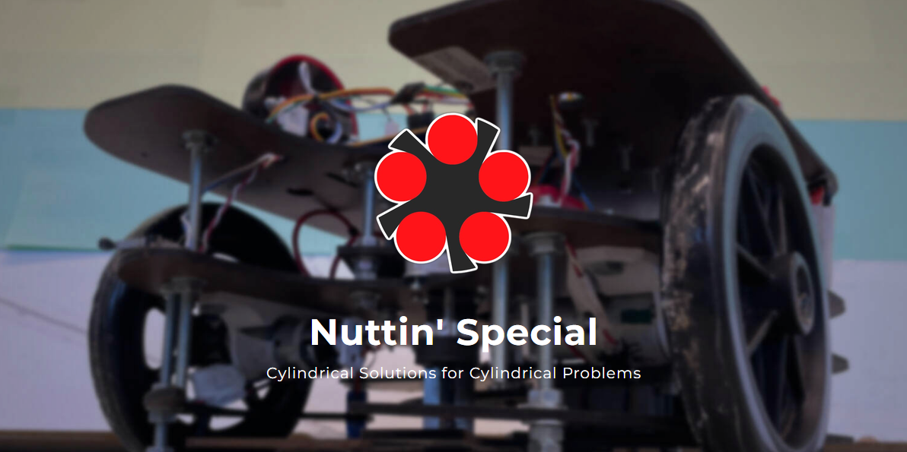
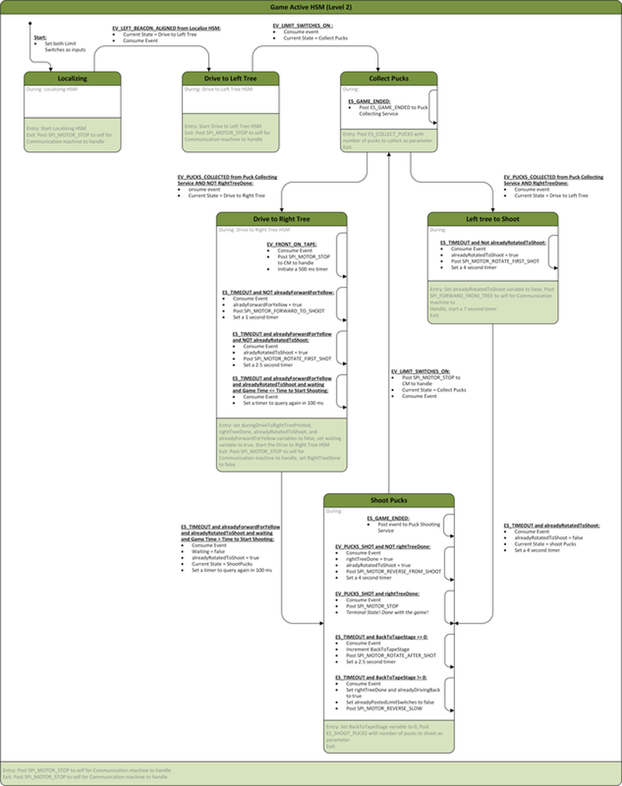
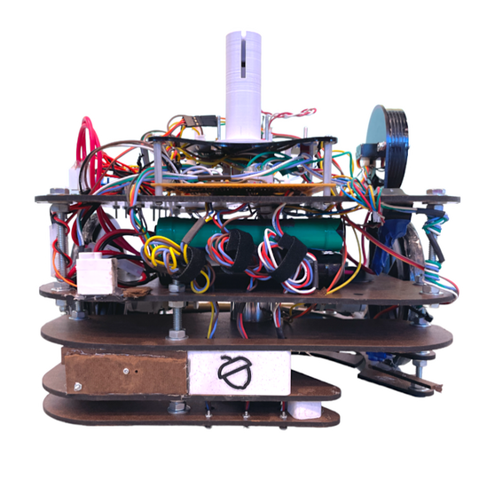
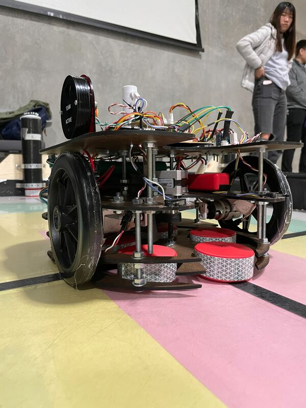

## 🚀 **Project Overview**  
- **Project Name:** System for Quick Removal of Litter (SQRL) - *Nuttin' Special*  
- **Role:** Embedded Systems & Integration Lead  
- **Technologies:** Embedded C, FSMs, HSMs, SPI, UART, PID Control, PIC32/Microchip, KiCad, MPLAB X, CAD  
- **Class:** ME218B: Smart Product Design Applications (Graduate-Level Mechatronics Series)  
- **Team Size:** 3 members  
- **Duration:** ~3 weeks  
- **Key Contributions:** Full Software Development, System Integration, Control Algorithms, Mechanical & Electrical Design Input  
- **Documentation:** <a href="https://nuttinspecial.weebly.com/" target="_blank" rel="noopener noreferrer">Project Website</a>  

  

---

# System for Quick Removal of Litter (SQRL) - *Nuttin' Special*

SQRL is an autonomous mobile robot designed for precision object retrieval in a competitive robotics challenge. It collects and delivers ACORNs (A Cylindrical Object Representing a Nut) using IR beacon detection, line-following, and real-time motion control. A dual-PIC32 microcontroller system, using SPI communication and hierarchical state machines (HSMs) in UML, enables efficient navigation and object manipulation.

---

## 🛠️ **Key Technologies & Concepts**  
- Embedded C/C++, FSMs & HSMs in UML (Microsoft Visio)  
- SPI-based Leader-Follower Communication  
- UART Debugging & Data Logging  
- PID Control for Precision Motor Actuation  
- Dual PIC32 Microcontroller System  
- Digital Signal Processing (Noise Filtering)  
- Line Following & Sensor Calibration  
- Low-Level Driver Development (Motors, Servos, Sensors)  
- System Integration & Debugging (Oscilloscope, Logic Analyzer)  
- Manual Stepper Motor Control (H-Bridge SN754410)  

---

## 👤 **My Role & Key Contributions**

- **End-to-End Embedded Software Development:** Designed and implemented the full software stack, including HSMs/FSMs, low-level drivers, SPI communication, UART debugging, and PID control algorithms.  
- **Embedded Systems & Integration Lead:** Led hardware-software integration, ensuring seamless coordination between mechanical, electrical, and software components.  
- **Autonomous Navigation & Control:** Developed localization strategies using IR beacon detection, line-following algorithms, and real-time encoder feedback.  
- **Sensor Noise Reduction:** Enhanced line-following reliability through digital filtering (moving average filters) combined with mechanical optimizations.  
- **Mechanical Design Optimization:**  
  - Designed servo-driven ACORN positioning (*increased shooting consistency by ~50%*).  
  - Optimized limit switch placement (*tree-parking accuracy improved from 70% → 95%*).  
  - Created 3D-printed sensor spacers for precise alignment.  
- **Electrical System Refinements:**  
  - Tuned beacon detection gain resistors (*boosted localization accuracy to near-perfect*).  
  - Configured servo multiplexing to maximize microcontroller resources.  
- **Strategic Architecture Design:** Established dedicated follower MCU for centralized motor control and efficient PID algorithms.  
- **Technical Documentation:** Created and maintained project documentation, including the project website, system architecture diagrams, and technical logs.  

---

## 🚩 **Key Challenges & Solutions**

- **Limited MCU Resources for Real-Time Control**  
  - *Solution:* Designed dual-PIC32 architecture, optimizing PWM allocation and processing constraints.  

- **Noisy Sensor Data Affecting Line Following**  
  - *Solution:* Applied moving average filtering and optimized sensor placement with 3D-printed spacers.  

- **ACORN Shooting Inconsistency (~50% failure rate)**  
  - *Solution:* Developed servo-driven positioning, eliminating jams and improving consistency by *50%*.  

- **Unreliable Limit Switch Parking Detection (70% accuracy)**  
  - *Solution:* Optimized limit switch placement and FSM logic, improving accuracy to *95%*.  

- **Localization Errors with IR Beacon Detection**  
  - *Solution:* Tuned gain resistors, achieving *~100% localization accuracy*.  

- **Manual Stepper Motor Control (No Driver Board)**  
  - *Solution:* Designed a custom step-sequencing algorithm, directly toggling H-bridge outputs.  

---

## 🧰 **Technical Stack & Validation**  

- **Microcontroller Development:** PIC32 with MPLAB X IDE  
- **Version Control:** Bitbucket & Git  
- **Hardware Tools:** KiCad, Oscilloscope, Logic Analyzer  
- **3D CAD Tools:** Sensor Spacers & Alignment  
- **Debugging Tools:** UART with Tera Term for real-time logging  
- **Technical References:** PIC32 Datasheets for SPI, PWM, and Peripheral Config  

**Testing & Validation:**  
- **Systematic Debugging:** Sensor calibration via UART logs & oscilloscope analysis.  
- **Signal Analysis:** SPI and PWM validation with logic analyzers.  
- **State Machine Testing:** Isolated HSM logic validation using UART-triggered events.  
- **Competition-Based Validation:** End-to-end system testing under real-world conditions. 

---

## 🌟 **Project Highlights**
- **Full-Stack Embedded Development:** Led the software design from low-level drivers to high-level decision-making architectures.  
- **Precision Control Algorithms:** Developed PID control loops for accurate, straight-line driving.  
- **Cross-Disciplinary Engineering:** Delivered impactful mechanical and electrical improvements, enhancing overall system performance.  
- **Competition Success:** Finalist in the HOA Most Beautiful Lawn Robot Competition, excelling with a reliability-focused strategy.  

---

## 💡 **Reflection & Lessons Learned**  

This project reinforced my expertise in embedded systems, hierarchical state machine design, and real-time motor control. Leading software development while driving mechanical and electrical optimizations deepened my ability to manage resource-constrained systems, optimize sensor-driven decision-making, and ensure robust system integration.  

---

## 📸 **Gallery**

- **SQRL in Action:** Start-up Localization Sequence & ACORN Collection  

  <iframe src="https://drive.google.com/file/d/1d-gqc7f94dtyTcR373HEQEWxhbr7_MFJ/preview" allow="autoplay"></iframe>

- **SQRL in Competition:** ACORN Shooting System (*Far-end robot*)  

  <iframe src="https://drive.google.com/file/d/1pDeGoWeNyME4syfYodX4Ss-jZO23sVah/preview" allow="autoplay"></iframe>

- **Game-Plan Hierarchical State Machine:**  

  

  

- **Assembly Views:**  

  
  
  

---

## 📂 **Project Documentation**
- 📄 <a href="../assets/docs/ME218b_W24_Project_Spec_Rev4.pdf" target="_blank" rel="noopener noreferrer">Project Handout (PDF)</a>
- 🌐 <a href="https://nuttinspecial.weebly.com/" target="_blank" rel="noopener noreferrer">Project Website</a>
- 🔗 <a href="https://nuttinspecial.weebly.com/software.html" target="_blank" rel="noopener noreferrer">Source Code</a>

