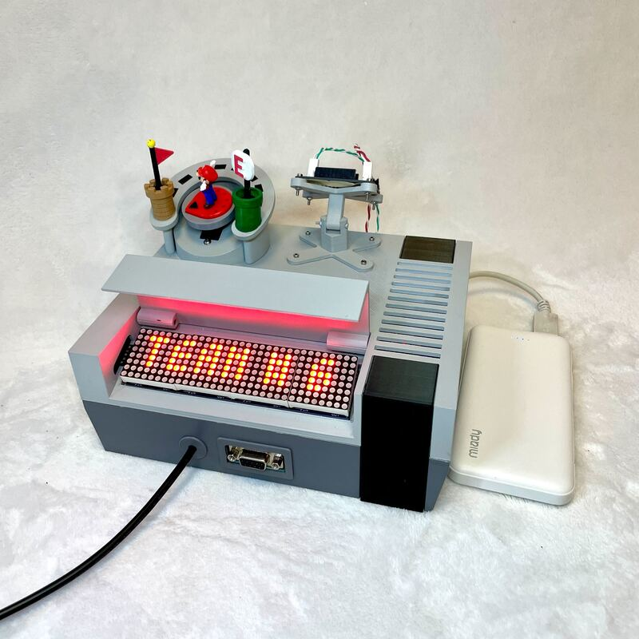
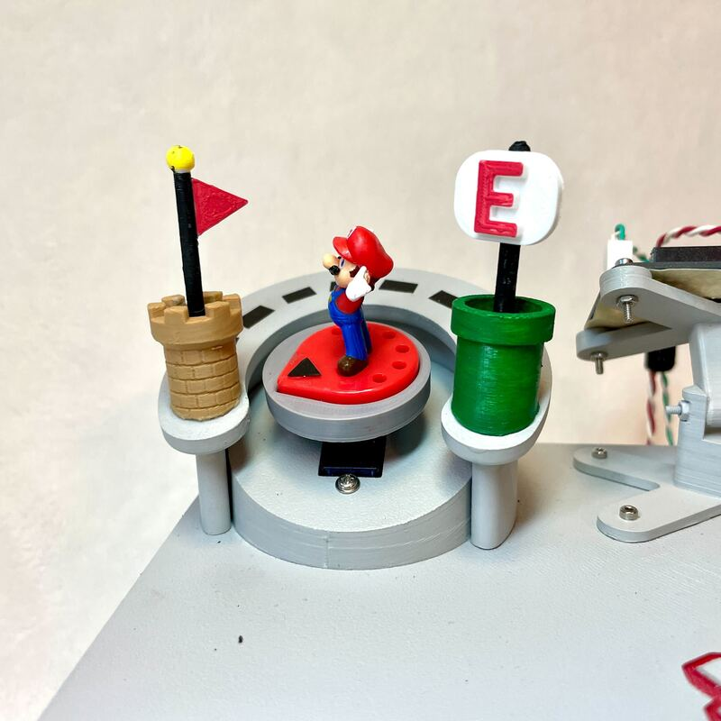
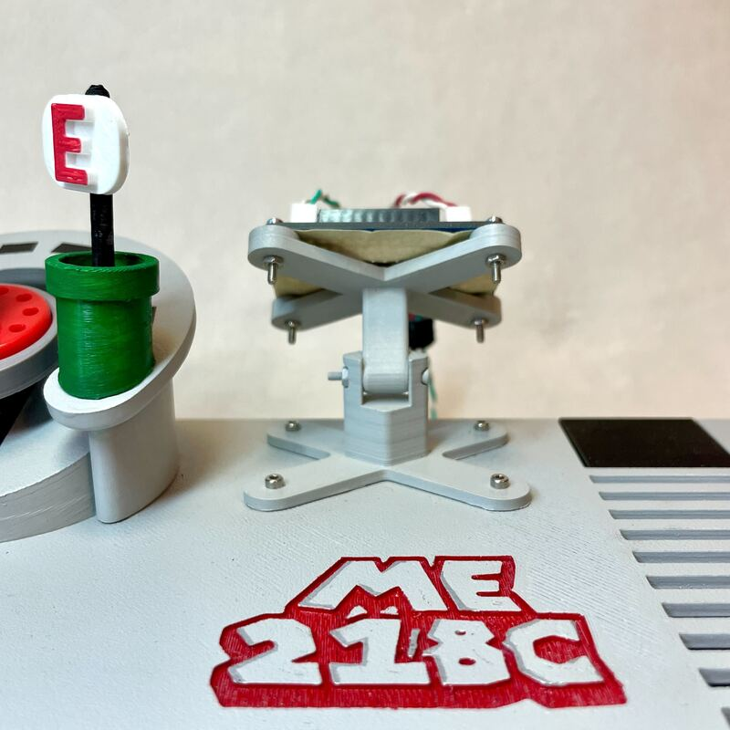
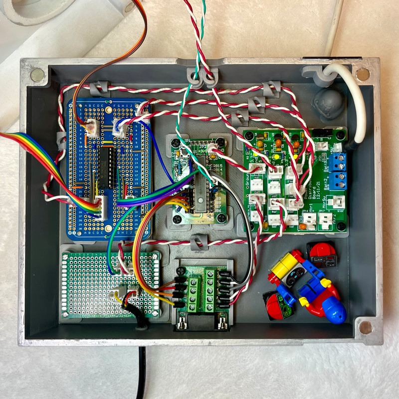
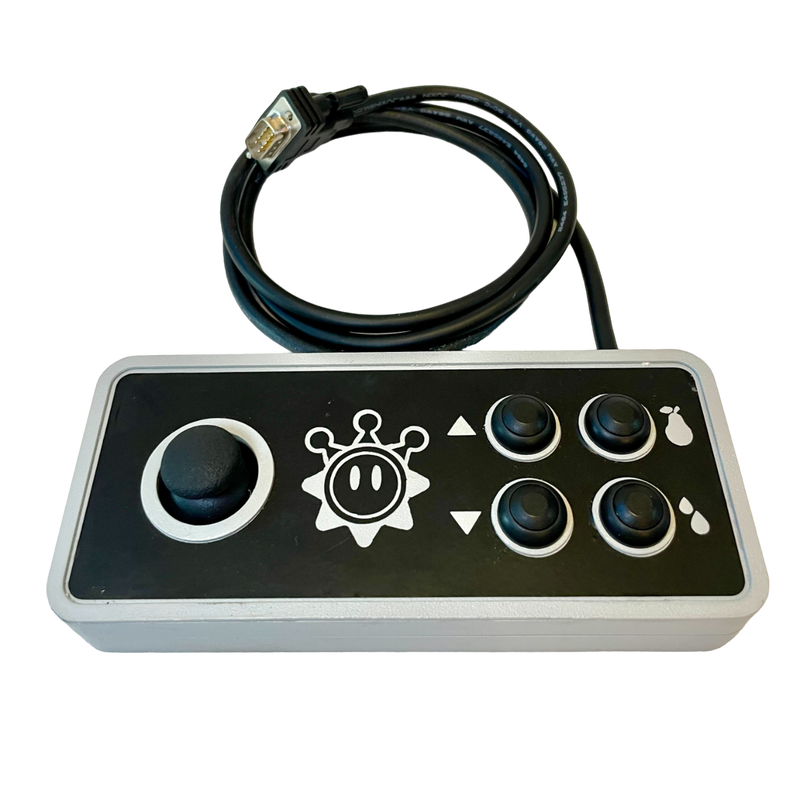
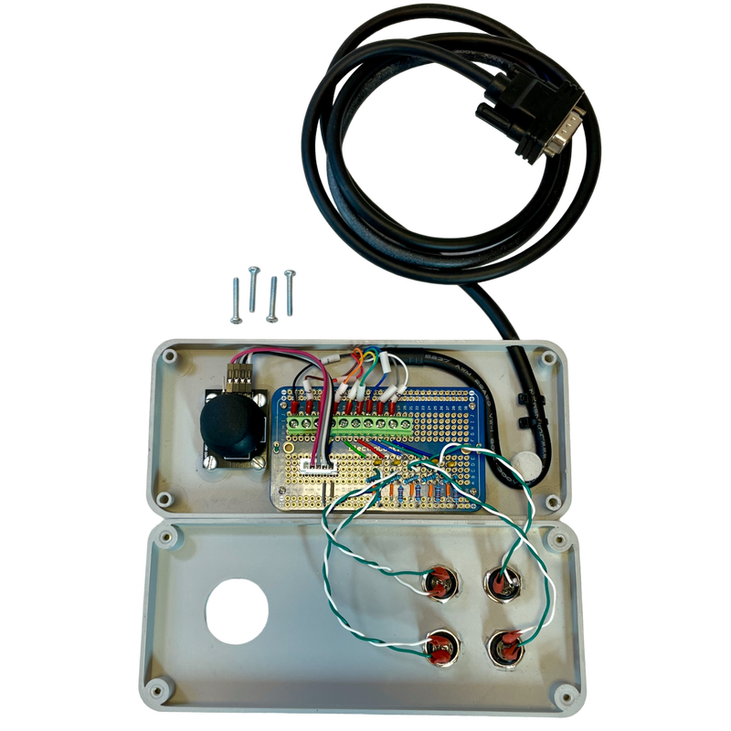
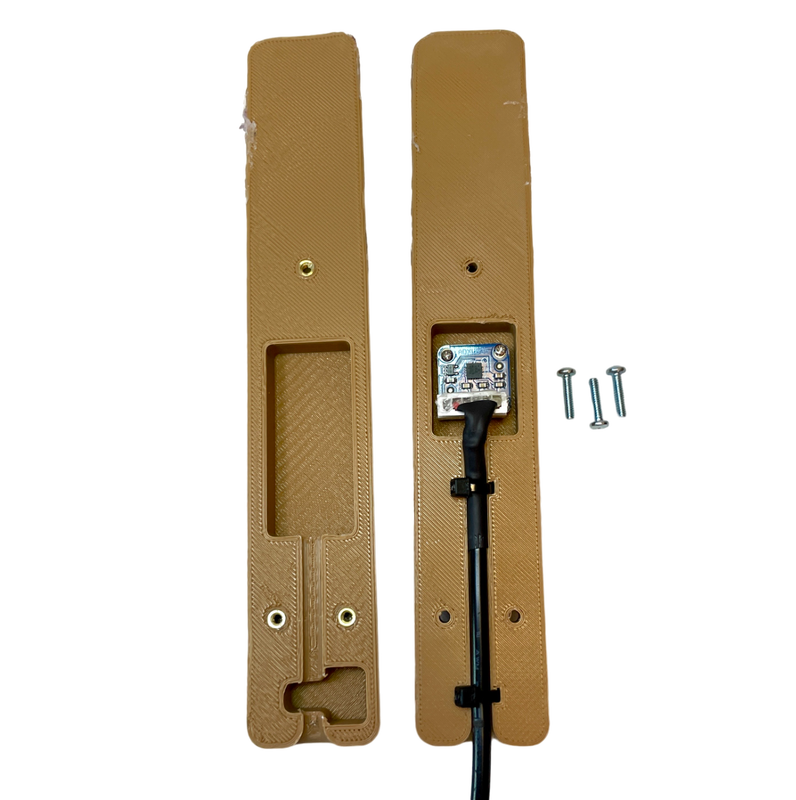
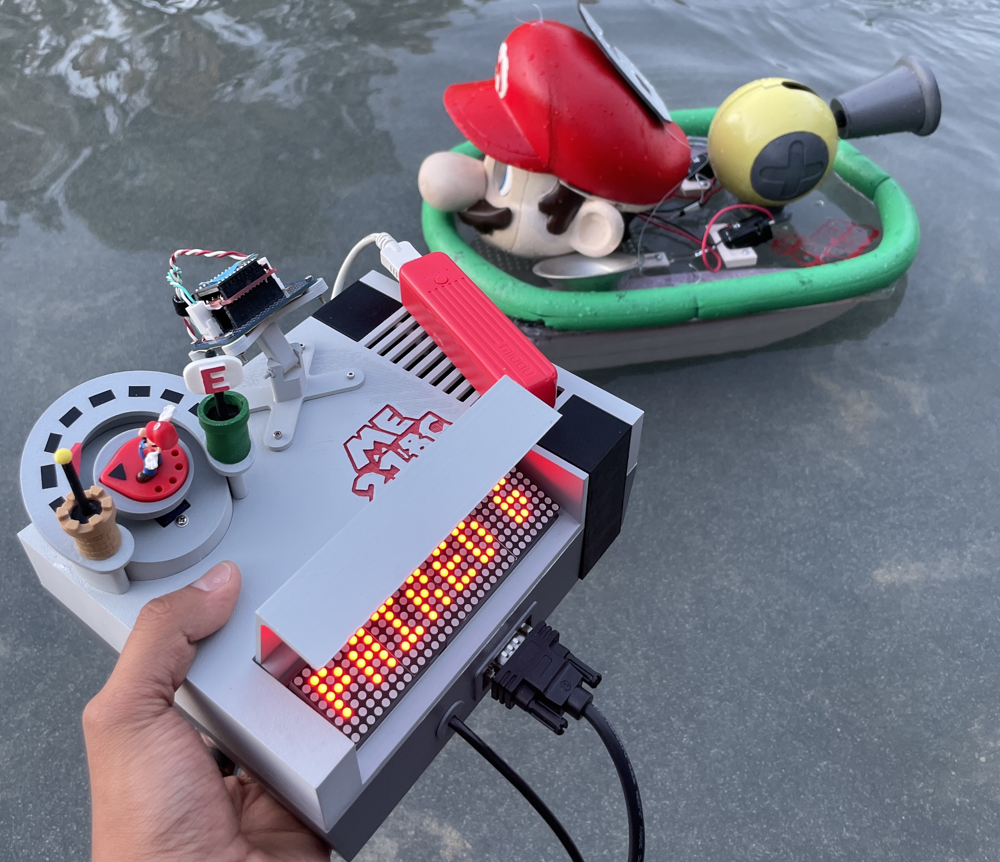
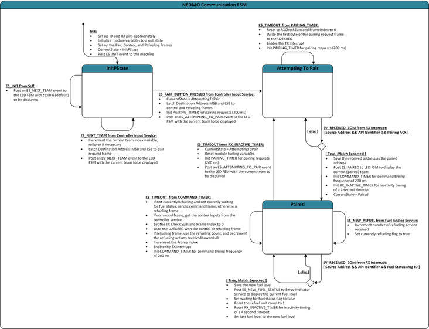
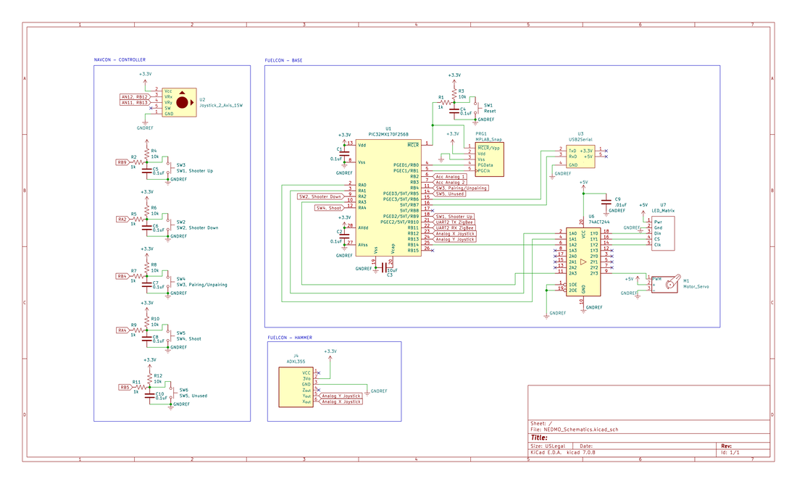

## 🚀 **Project Overview**  
- **Project Name:** Super KARLio - *Nautical Electromechanical Device for Mobile Operation (NEDMO)*  
- **Role:** Embedded Systems & Controller Design Lead 
- **Technologies:** Embedded C/C++, FSMs, UART, SPI, XBee (Zigbee), Analog Signal Processing, PIC32, KiCad, Fusion 360, MPLAB X  
- **Class:** ME218C: Smart Product Design Applications (Graduate-Level Mechatronics Series)  
- **Team Size:** 3 members  
- **Duration:** ~3 weeks  
- **Key Contributions:** System Architecture, Embedded Software, Wireless Protocols, Electrical Design, Mechanical Integration  
- **Theme:** Inspired by *Super Mario Sunshine*  
- **Documentation:** [Project Website](https://superkarlio.weebly.com/){:target="_blank"}  
- **🎥 Demo:**  

  
  <iframe src="https://www.youtube.com/embed/dUoI39grSPE" frameborder="0" allowfullscreen></iframe>  

  

---

# **Super KARLio - *Nautical Electromechanical Device for Mobile Operation (NEDMO)***  

*Super KARLio* is a Nintendo-inspired project designed to control an autonomous aquatic robot, the *0 Ingress Lightweight Uncrewed Scuttlebutt (0ILUS)*, via a custom NES-style controller (*NEDMO*). The NEDMO wirelessly communicates with the 0ILUS using XBee (Zigbee) modules for real-time control of propulsion, refueling, and water-shooting mechanisms. The system integrates embedded software, custom protoboards, analog signal processing, and retro-inspired mechanical design for an immersive, game-like experience.

---

## 🛠️ **Key Technologies & Concepts**  
- Embedded C/C++ (Modular Event-Driven Architecture)  
- Finite State Machines (FSMs) for Control & Communication  
- UART & SPI Communication (XBee Wireless, LED Matrix Display)  
- Real-Time Interrupt Handling for Low-Latency Control  
- Analog Signal Processing (Accelerometer-Based Refueling)  
- Power Distribution & Signal Integrity Optimization (Twisted Pairs, Decoupling Capacitors)  
- Hardware-Software Co-Design (PIC32, KiCad)  
- Mechanical Design (Fusion 360, 3D Printing with Bambulab)  
- System Integration Testing (UART Logs, Oscilloscopes, Debugging Tools)  

---

## 👤 **My Role & Key Contributions**  

- **System Architecture:** Led the end-to-end design of NEDMO, integrating software, hardware, and mechanical systems.  
- **Embedded Software Development:** Designed FSMs for wireless communication, joystick/button inputs, and real-time LED display management.  
- **Wireless Communication:** Engineered UART-based XBee protocols (Zigbee) for low-latency control.  
- **Motion-Based Refueling:** Developed an accelerometer-driven refueling mechanism with analog filtering to ensure signal stability.  
- **Mechanical Design:** CAD-modeled NES-inspired controller and console with magnetic latches, strain relief, and retro aesthetics.  
- **Electrical Design:** Designed custom circuits, handled power distribution, and implemented robust signal conditioning.  
- **System Integration:** Ensured seamless hardware-software communication and modular system debugging.

---

## ⚡ **Detailed Electronics Design**  

As the **Embedded Systems & Controller Design Lead**, I was responsible for the electrical architecture of NEDMO, focusing on power distribution, signal conditioning, and embedded system reliability.

### **FUELCON System - Base Unit**  
- **Purpose:** Central hub for fuel management, status display, and wireless communication.  
- **Key Components:**  
  - **MAX7219 Dot Matrix Display:** Displays communication status and active 0ILUS unit.  
  - **270° Servo Motor:** Visual fuel indicator, driven via buffered control signals.  
  - **Signal Conditioning:**  
    - **Octal Buffer (74ACT244):** Steps up PIC32’s +3.3V control signals to +5V for high-current peripherals.  
    - **Decoupling Capacitors:** Stabilize voltage near ICs to reduce noise.  
  - **Power Distribution:** Optimized with twisted power pairs to minimize EMI and ensure clean +3.3V/+5V lines from a USB battery pack.  

---

### **🔨 FUELCON - Hammer Refueling Mechanism**  
- **Design:** Motion-based refueling inspired by *Super Mario Bros.*  
- **Key Features:**  
  - **ADXL355 ±3g Analog Accelerometer:** Detects hammer swings to trigger refueling events.  
  - **Signal Processing:**  
    - Analog filtering and digital moving averages to reduce noise.  
    - Connected via JXT-XH connectors for robust signal integrity.  
  - **Microcontroller Interface:** Accelerometer outputs wired to PIC32 analog inputs (X, Y axes).

---

### 🎮 **NAVCON - NES-Inspired Controller**  
- **Purpose:** Real-time navigation control for the 0ILUS aquatic robot.  
- **Key Components:**  
  - **User Inputs:** 4 debounced buttons (160 Hz cutoff) + 2-axis joystick.  
  - **Signal Interface:**  
    - **DB9 Connector:** Secure modular connection to the FUELCON base with strain-relief mechanisms.  
    - **Hardware Debouncing:** Reduces false triggers, ensuring responsive control.  
    - **Expandability:** Reserved wiring for future button additions.

---

## 🚩 **Key Challenges & Solutions**  

✅ **Ensuring Low-Latency Wireless Communication**  
- *Problem:* Initial XBee setup suffered **delayed responses** due to inefficient polling.  
- *Solution:* Implemented **UART interrupt-driven transmission**, reducing **latency by ~40%**.  

✅ **Mitigating Signal Noise in Accelerometer-Based Refueling**  
- *Problem:* Raw sensor data was **highly sensitive to vibration and external motion**.  
- *Solution:* Applied **analog filtering + digital moving averages** for stability.  

✅ **Optimizing Power Distribution & Grounding**  
- *Problem:* Early iterations **suffered from voltage fluctuations** affecting servo stability.  
- *Solution:* Used **decoupling capacitors + twisted-pair routing** to **reduce EMI & voltage dips**.  

✅ **Mechanical Durability & Controller Usability**  
- *Problem:* Early prototypes lacked **strain relief**, leading to **wiring failures under stress**.  
- *Solution:* **Redesigned wiring with reinforced DB9 connectors** and **built-in strain relief**.  

---

## 🌟 **Project Highlights**  
✔ **End-to-End Embedded System:** Designed **firmware, communication protocols, and hardware integration**.  
✔ **Low-Latency Wireless Control:** Achieved **responsive bidirectional communication** with **interrupt-based UART XBee protocols**.  
✔ **Analog Signal Processing for Motion-Based Input:** Built a **real-time accelerometer-driven refueling mechanism**.  
✔ **Cross-Disciplinary Engineering:** Balanced **embedded design, wireless protocols, and mechanical integration**.  

---

## 💡 **Reflection & Lessons Learned**  

Working on *Super KARLio* was an immersive experience in embedded systems, real-time communication, and hardware-software co-design. Leading NEDMO’s development taught me the importance of modular architectures, robust protocols, and balancing technical performance with user-centric design.

---

## 📸 **Gallery**

- **Super KARLio in Action** 

  <iframe src="https://drive.google.com/file/d/14LNPfPP-Z0OrEcZv3UUecbrSWsr1tCLD/preview" width="640" height="480" allow="autoplay"></iframe>

- **Design:**  

  
  
  
  
  
  
  
  
  

- **Communication Architecture Diagram:**  

  

- **Schematics:**  

  

---

## 📂 **Project Documentation**  
- 📄 <a href="../assets/docs/ME218C_S24_Project_Spec.pdf" target="_blank" rel="noopener noreferrer">Project Handout (PDF)</a>  
- 🌐 <a href="https://superkarlio.weebly.com/" target="_blank" rel="noopener noreferrer">Project Website</a>  
- 🔗 <a href="https://superkarlio.weebly.com/mechanical.html" target="_blank" rel="noopener noreferrer">Files</a>  
