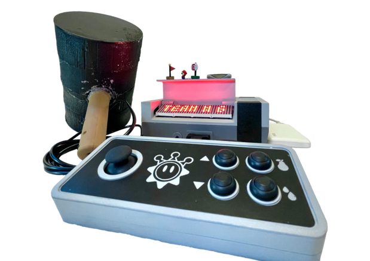

## 🚀 **Project Overview**  
- **Project Name:** Super KARLio - *Nautical Electromechanical Device for Mobile Operation (NEDMO)*  
- **Role:** Embedded Systems & Controller Design Lead 
- **Technologies:** Embedded C, FSMs, UART, SPI, XBee (Zigbee), Analog Signal Processing, PIC32, KiCad, Fusion 360, MPLAB X  
- **Class:** ME218C: Smart Product Design Applications (Graduate-Level Mechatronics Series)  
- **Team Size:** 3 members  
- **Duration:** ~3 weeks  
- **Key Contributions:** System Architecture, Embedded Software, Wireless Protocols, Electrical Design, Mechanical Integration  
- **Theme:** Inspired by *Super Mario Sunshine*  
- **Documentation:** [Project Website](https://superkarlio.weebly.com/){:target="_blank"}  
- **🎥 Demo:**  

  
  <iframe src="https://www.youtube.com/embed/dUoI39grSPE" frameborder="0" allowfullscreen></iframe>  

  

---

# **Super KARLio - *Nautical Electromechanical Device for Mobile Operation (NEDMO)***  

*Super KARLio* is a Nintendo-inspired embedded system that enables real-time control of an autonomous aquatic robot (*0ILUS*) via a custom-built NES-style controller (*NEDMO*). NEDMO wirelessly communicates with 0ILUS using custom XBee (Zigbee) protocols, handling propulsion, refueling, and water-shooting. The system integrates event-driven firmware, custom electrical design, analog signal processing, and retro-inspired mechanical design for an immersive, game-like experience.

---

## 🛠️ **Key Technologies & Concepts**  
- Embedded C (Modular Event-Driven Architecture)  
- Finite State Machine based Control & Communication 
- Custom UART Interrupt-Driven XBee Protocols
- SPI Communication (LED Matrix Display)  
- Real-Time Interrupt Handling for Low-Latency Control  
- Analog Signal Processing (Accelerometer-Based Refueling)  
- Power Distribution & Signal Integrity Optimization (Twisted Pairs, Decoupling Capacitors)  
- Hardware-Software Co-Design (PIC32, KiCad, Fusion 360)   
- System Debugging & Validation (Oscilloscope, UART Logs, Simulation)   

---

## 👤 **My Role & Key Contributions**  

- **System Architecture:** Led the end-to-end design of NEDMO, integrating software, hardware, and mechanical systems.  
- **Embedded Software:** Designed custom FSMs for wireless control, real-time joystick inputs, and LED display management.  
- **Wireless Communication:** Developed custom UART-based XBee protocols** for **low-latency, bidirectional control.  
- **Motion-Based Refueling:** Built an accelerometer-driven refueling system with analog signal filtering for noise reduction.  
- **Mechanical Design:** CAD-modeled NES-style controller and console with magnetic latches, strain relief, and retro aesthetics.  
- **Electrical Design:** Designed custom circuits, optimized power distribution, and implemented signal conditioning for stability.  
- **System Integration & Debugging:** Ensured seamless hardware-software communication and modular system debugging.

---

## ⚡ **Detailed Electronics Design**  

### **FUELCON - Base Unit & Signal Hub**  
- **Purpose:** Manages fuel distribution, status display, and wireless communication.  
- **Key Components:**  
  - **MAX7219 LED Matrix:** Displays system status and active 0ILUS unit.  
  - **270° Servo Motor:** Provides a visual fuel level indicator.  
  - **Octal Buffer (74ACT244):** Steps up PIC32’s 3.3V control signals to 5V for high-current peripherals.  
  - **Decoupling Capacitors:** Prevents voltage drops and EMI noise.  
  - **Twisted-Pair Routing:** Optimized power delivery from a USB battery pack.  

### **🔨 Hammer-Based Refueling Mechanism**  
- **ADXL355 ±3g Accelerometer:** Detects hammer swings for refueling events.  
- **Analog Filtering & Digital Moving Averages:** Stabilizes noisy sensor data.  
- **Modular Connector Design:** Uses JXT-XH connectors for reliable signal integrity.  

### 🎮 **NAVCON - NES-Inspired Controller**  
- **Purpose:** Real-time control of the 0ILUS aquatic robot.  
- **Key Features:**  
  - **4 Debounced Buttons + 2-Axis Joystick:** Processed via hardware debouncing & software filtering.  
  - **DB9 Connector:** Modular interface with strain relief for durability.  
  - **Future Expansion:** Reserved wiring for additional control inputs.  

---

## 🚩 Key Engineering Challenges & Solutions  

- **Ensuring Seamless Cross-Team Compatibility**  
  - *Challenge:* Every controller needed to control any team's boat via a standardized pairing protocol, requiring robust communication across independently designed systems.  
  - *Solution:* Designed a flexible UART-based pairing system, ensuring universal compatibility while collaborating with other teams to refine communication protocols.  

- **Designing for Frequent Handling & Transport**  
  - *Challenge:* The system needed to be repeatedly transported between test environments, and project requirements mandated that all components remain in separate physical enclosures.  
  - *Solution:* Integrated detachable DB9 connectors with built-in strain relief, ensuring durability and ease of reconfiguration during testing and usage.  

- **Managing Mixed-Voltage Components & Power Stability**  
  - *Challenge:* The system contained both 5V and 3.3V logic-level components, requiring careful integration to prevent signal integrity issues. Additionally, a single power source had to drive motors, LED displays, logic circuits, sensors, and inputs, making noise isolation and voltage stability critical.  
  - *Solution:* Used buffers (74ACT244) for logic-level shifting and designed a regulated power distribution system with decoupling capacitors, twisted-pair routing, and proper grounding techniques to minimize noise and ensure stable operation across all subsystems.  

---

## 🌟 Project Highlights  
- Developed a real-time embedded system with custom UART-based Zigbee communication.  
- Integrated multi-MCU control for wireless navigation, refueling, and status displays.  
- Designed a stable power system for mixed-voltage components and noise reduction.  
- Improved accelerometer-based refueling with hardware and software filtering.  
- Used DB9 connectors with strain relief for durability and easy reconfiguration.  
- Ensured cross-team compatibility with a flexible controller pairing system.  

---

## 💡 Reflection & Lessons Learned  

Working on *Super KARLio* was an immersive experience in embedded systems, real-time communication, and hardware-software co-design. Leading NEDMO’s development taught me the importance of modular architectures, robust protocols, and balancing technical performance with user-centric design.

---

## 📸 **Gallery**

- **Super KARLio in Action** 

  <iframe src="https://drive.google.com/file/d/14LNPfPP-Z0OrEcZv3UUecbrSWsr1tCLD/preview" width="640" height="480" allow="autoplay"></iframe>

- **Design:**  

  
  
  
  
  
  
  
  
  

- **Communication Architecture Diagram:**  

  

- **Schematics:**  

  

---

## 📂 **Project Documentation**  
- 📄 <a href="../assets/docs/ME218C_S24_Project_Spec.pdf" target="_blank" rel="noopener noreferrer">Project Handout (PDF)</a>  
- 🌐 <a href="https://superkarlio.weebly.com/" target="_blank" rel="noopener noreferrer">Project Website</a>  
- 🔗 <a href="https://superkarlio.weebly.com/mechanical.html" target="_blank" rel="noopener noreferrer">Files</a>  
