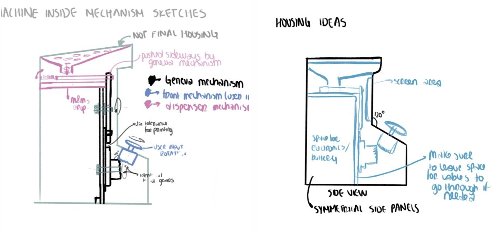
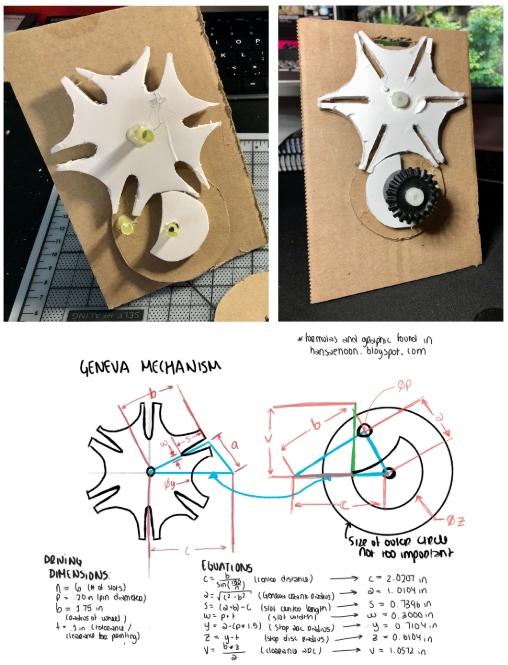
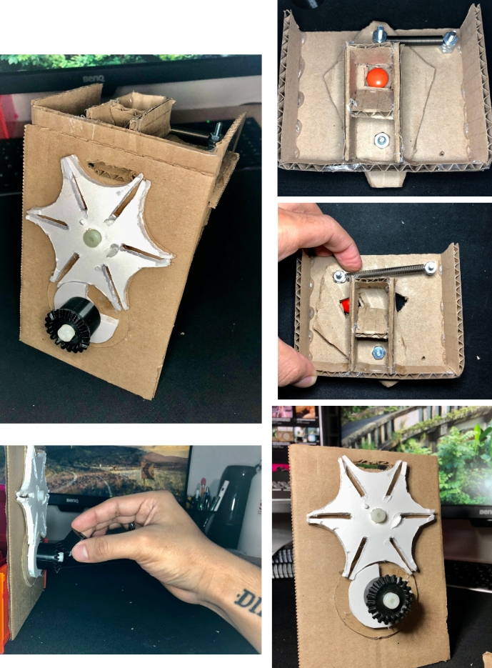
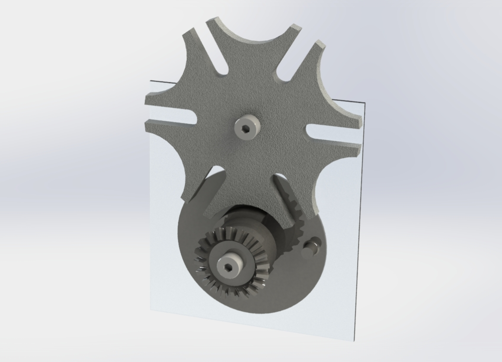
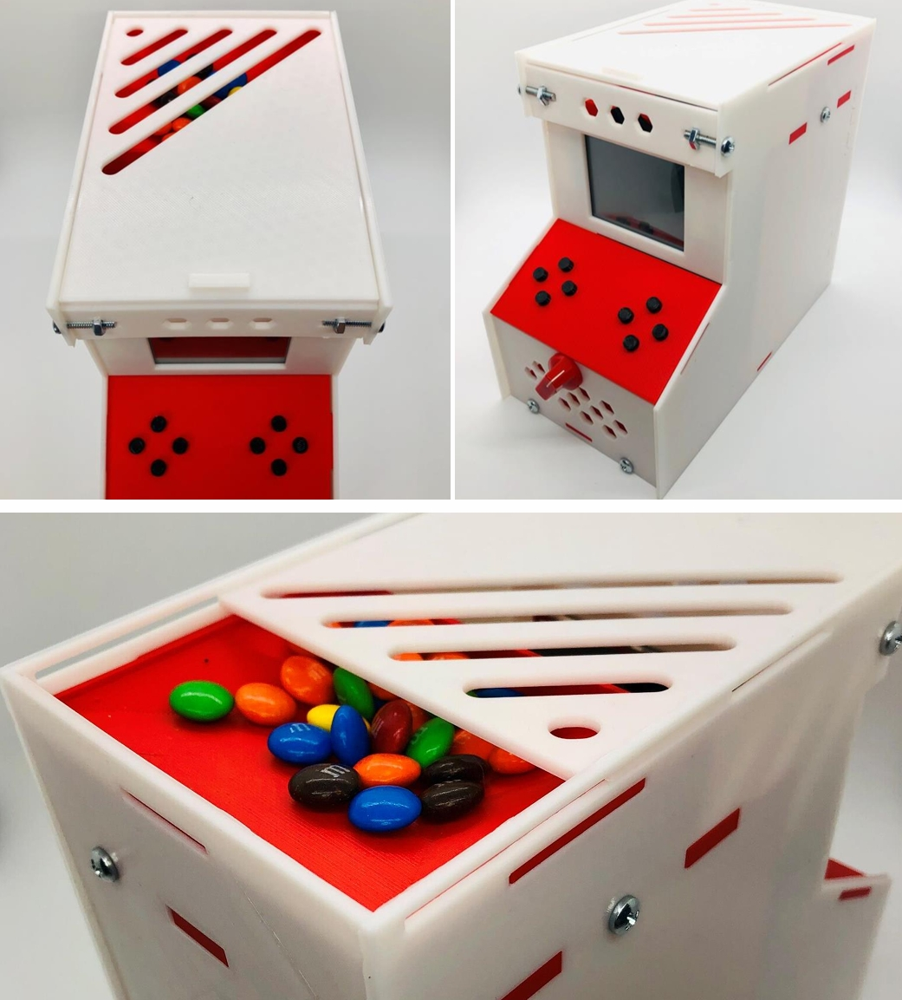
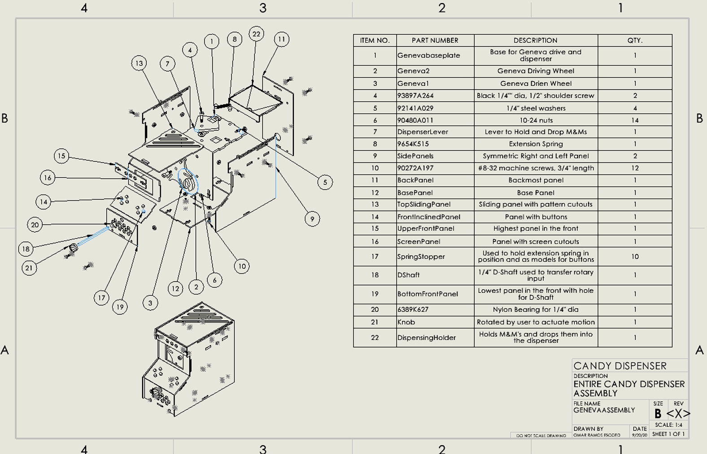
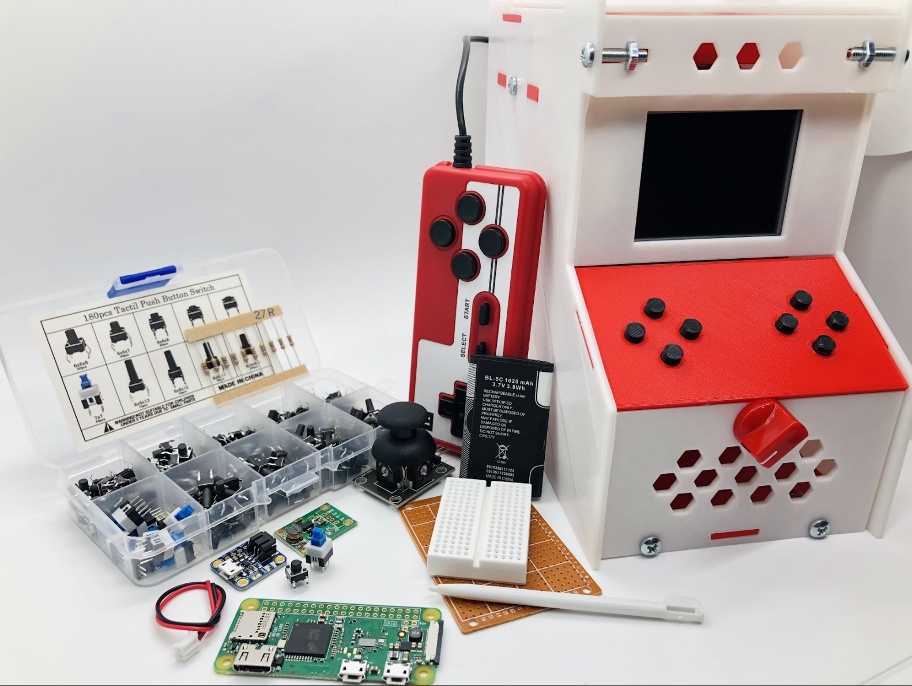

## 🚀 **Project Overview**  
- **Project Name:** M&M Arcade Dispenser  
- **Role:** Designer & Fabricator  
- **Technologies:** Geneva Drive, CAD (SolidWorks), 3D Printing, Stock Component Integration  
- **Class:** ME102: Foundations of Product Realization
- **Duration:** ~3 weeks  
- **Key Contributions:** Mechanism Design, Prototyping, Manufacturing Optimization  
- **Documentation:**  
  - 📄 <a href="../assets/docs/M&M_Dispenser_Project.pdf" target="_blank" rel="noopener noreferrer">Final Report</a>  

  <iframe src="https://drive.google.com/file/d/1XAvZR5me__UgfUgTXDbxldsE-9RnPBeQ/preview" 
          frameborder="0" 
          width="800" 
          height="600"></iframe>

- **🎥 Demo:**  

  
  <iframe src="https://drive.google.com/file/d/1Xeg5OSYFKUcotQ5dJWU7uME6U7k0IyDw/preview" width="640" height="480" allow="autoplay"></iframe>

  

---

## 🎯 **Project Objective & Constraints** 

The goal of this project was to design a *desktop mechanical candy dispenser* that:  
✔ **Uses rotary motion and springs** to control dispensing.  
✔ **Dispenses one M&M per user input** and resets automatically.  
✔ **Stores at least 10 M&Ms at a time**.  
✔ **Operates with one hand** for ease of use.  

The final design was heavily inspired by arcade machines and incorporated a Geneva drive to convert continuous rotation into precise, intermittent motion for controlled dispensing.  

🏆 **Results:**  
- **Functional & Reliable Dispensing:** Achieved precise single M&M dispensing per turn.  
- **Iterative Mechanism Refinement:** Improved alignment, force application, and component tolerances.  
- **Integrated Arcade-Themed User Experience:** The interaction mimics turning a retro arcade control knob.  

---

## 🔧 **Design & Iteration Process**  

### **1️⃣ Prototyping & Early Mechanism Development**  
- Initially explored gravity-fed mechanisms, but they lacked precision.  
- Discovered **Geneva Drive Mechanisms** and tested how *intermittent rotary motion* could precisely control dispensing.  
- Early 3D-printed prototypes revealed tolerance issues—alignment had to be extremely precise for smooth operation.  

  
  

---

### **2️⃣ Geneva Drive Integration & Dispensing Mechanism**  
- **First Attempt:** Geneva drive pressed a button to release candy.  
  - ❌ *Issue:* The Geneva wheel didn’t provide enough force to depress the button.  
- **Final Approach:** Used a lever arm controlled by the Geneva drive, allowing for a smooth tangential force application.  
  - ✅ *Solution:* Added an extension spring to return the lever to a stable position.  

  
  

---

### **3️⃣ Material & Manufacturing Considerations**  
- **Stock Components:** Used **bearings, machine screws, springs, and washers** to enhance durability.  
- **3D Printing Challenges:**  
  - Discovered that different filament colors & brands extruded differently, requiring tolerance adjustments for proper fits.  
  - Optimized print settings and part orientation for strength and better surface finish 

  

---

## ⚙️ **Challenges & Solutions**  

- **❌ Geneva Drive Alignment Issues**  
  - *Issue:* Minor misalignments caused skipping or binding.  
  - ✅ *Solution:* Increased tolerances and improved print accuracy with better bearing integration.  

- **❌ Bevel Gear Precision Problems**  
  - *Issue:* Early designs used 120° bevel gears to connect user input, but 3D printing inaccuracies caused failures.  
  - ✅ *Solution:* Switched to a D-shaft & knob system, which was simpler, stronger, and more intuitive.  

- **❌ Ensuring Consistent Candy Dispensing**  
  - *Issue:* M&Ms jammed in the slot due to variability in candy size.  
  - ✅ *Solution:* Modified the chute geometry and added a sliding gate mechanism to regulate flow.  

---

## 🖼️ **Gallery**  

### **Final Build & Mechanism**  

  
  

  

- **Dispensing Demonstration:**  

  
  <iframe src="https://drive.google.com/file/d/1Xeg5OSYFKUcotQ5dJWU7uME6U7k0IyDw/preview" width="640" height="480" allow="autoplay"></iframe>

  

---

## 🎓 **Key Takeaways**  

✔ **Tolerance & Precision Matter in Mechanical Design** – Geneva mechanisms require tight alignment for smooth operation.  
✔ **Iterative Prototyping Is Essential** – Rapid prototyping helped refine each subsystem, especially dispensing accuracy.  
✔ **Stock Component Integration Improves Reliability** – Bearings, springs, and screws reduced friction and increased durability.  
✔ **User Experience Considerations Are Crucial** – Simplifying input from bevel gears to a knob system improved usability.  

---

## 🌟 **Final Thoughts**  

This project was an exciting combination of *mechanism design, user interaction, and iterative prototyping*. The arcade-inspired theme enhanced the experience while mechanical refinements ensured precise, single-candy dispensing.  

While this project primarily focused on mechanical design, I planned ahead to accommodate a small Raspberry Pi, buttons, and a 2.8” TFT touchscreen, leaving space for a future upgrade into a fully functional arcade emulator. Though I didn’t have time to complete the electronics integration, the enclosure was intentionally sized to fit these components.

  

---
