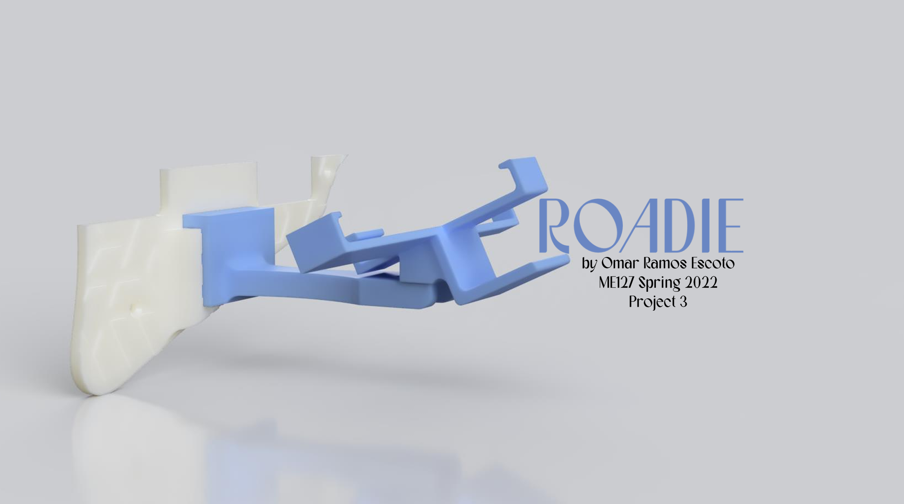
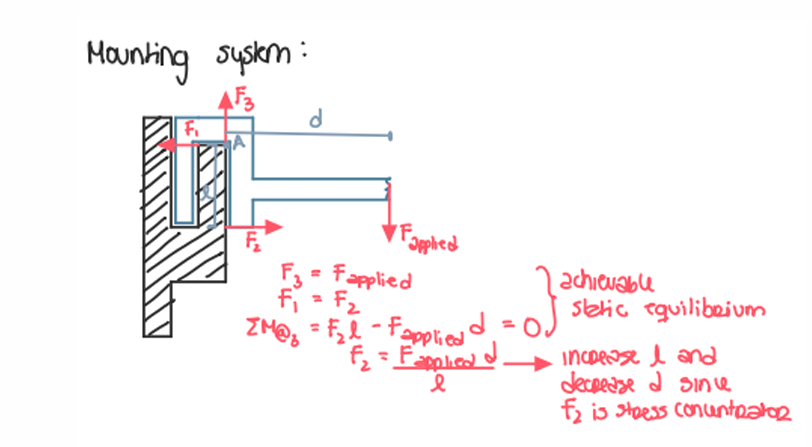
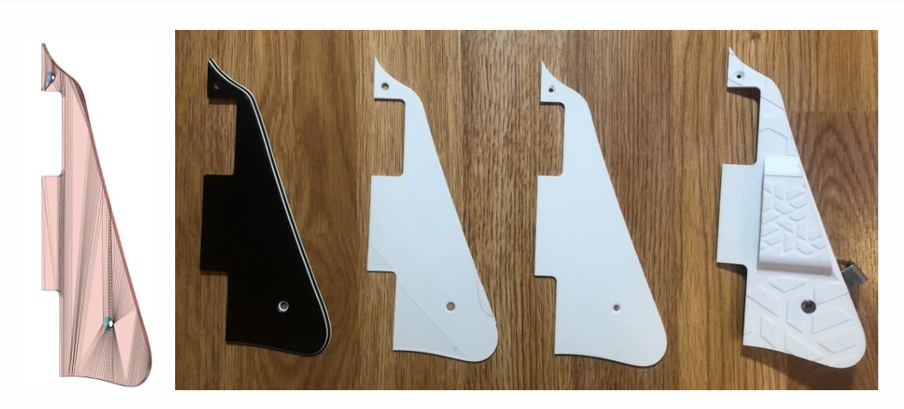
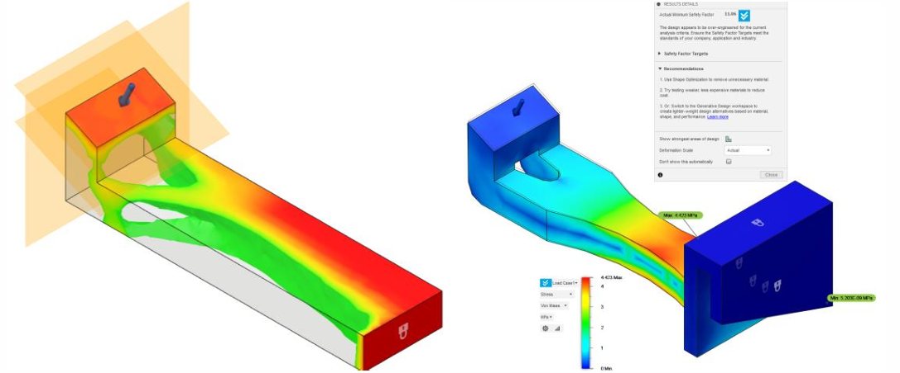
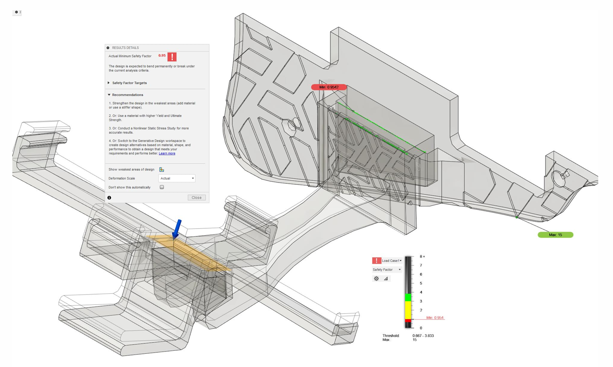
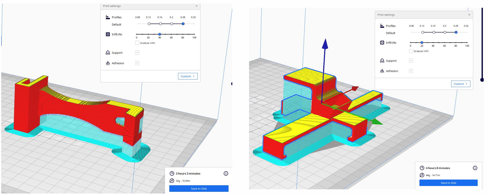
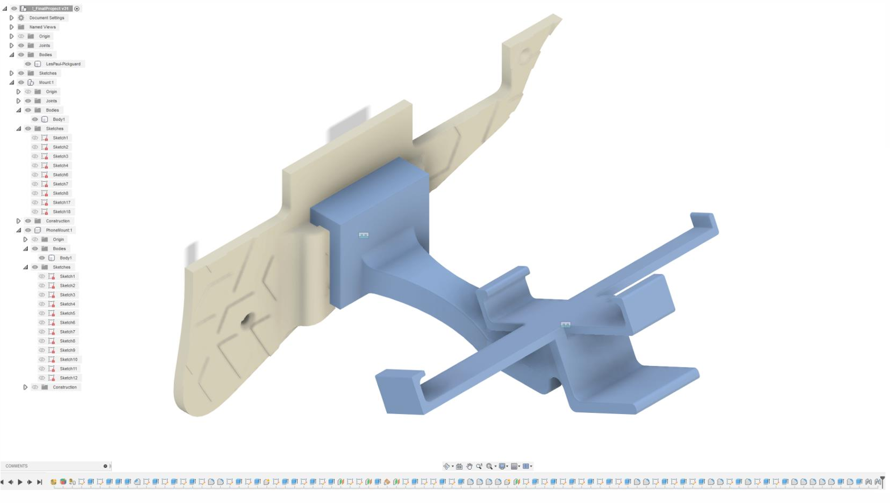
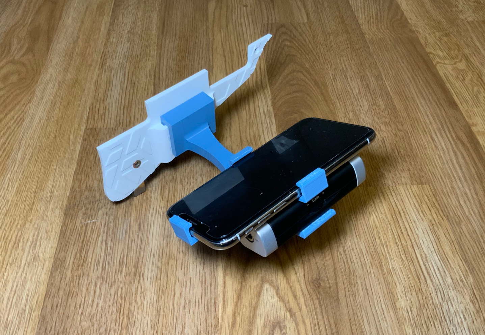
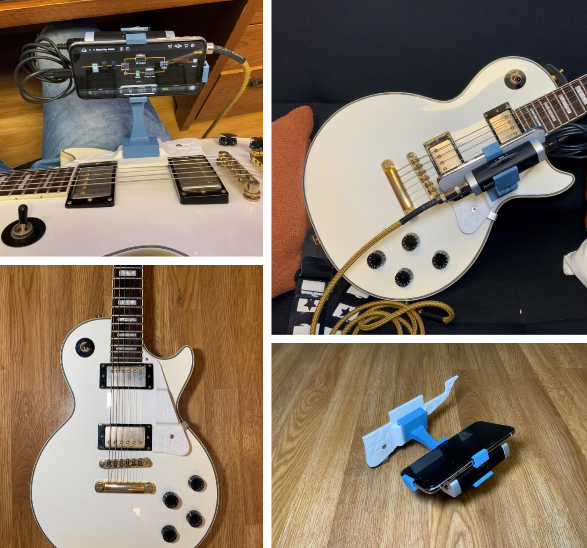

## 🚀 **Project Overview**  
- **Project Name:** Roadie  
- **Role:** Designer & Fabricator  
- **Technologies:** FDM 3D Printing, Fusion 360, Algorithmic Modeling, Finite Element Analysis, Shape Optimization  
- **Class:** ME127: Design for Additive Manufacturing  
- **Duration:** ~2 weeks  
- **Key Contributions:** CAD Modeling, Shape Optimization, Fixture Design, 3D Printing  

  

  <iframe src="https://drive.google.com/file/d/1E6FkMiVYVRvuu7Iws-eCsfAgOxsebXie/preview" 
          frameborder="0" 
          width="800" 
          height="600"></iframe>

---

## 🎸 **Inspiration & Problem Statement**  

I’ve played electric guitar since high school, but I often find myself avoiding it because setting up cables and adjusting settings while holding my guitar is cumbersome and frustrating.  

Market solutions like clips and suction cups didn’t work well for my use case, and traditional clamps were either bulky or damaging to the guitar finish. The challenge was finding a secure, lightweight, and ergonomic way to mount my phone and audio interface while ensuring easy reach.  

**Key Design Goals:**  
✔ **Seamless integration with the guitar** – No interference with playing  
✔ **Quick assembly & disassembly** – Modular and tool-free attachment  
✔ **Optimized for 3D printing** – Lightweight, strong, and manufacturable  

---

## ✏️ **Design & Iteration**  

Finding a mounting location was the biggest challenge. After several iterations, I realized the pickguard provided a stable, flat, and modular mounting point.  

- **Mesh Conversion:** Used *Fusion 360 mesh tools* to convert a scanned pickguard model into a solid body for precise hole alignment.  
- **Slot Mechanism:** Designed a tool-free slide-in attachment for easy assembly.  
- **Algorithmic Shape Optimization:** Leveraged FEA to remove unnecessary material while maintaining strength.  

  
  
  
  
  

  

---

## 🛠️ **Manufacturing Process**  

### **Material Selection & Printing Challenges**  
- **Initial Plan:** Nylon for impact resistance and compliance  
- **Issue:** Printer had layer shifting and warping issues  
- **Solution:** Switched to PLA, which provided good dimensional stability, low brittleness, and aesthetic matching  

### **Part-Specific Printing Considerations**  
- **Cantilever Arm:** Printed with layers aligned to the axis to reduce shear stress.  
- **Phone Holder:** Designed for snap-fit assembly, allowing both side sliding and top insertion.  
- **Pickguard Mounting Bracket:** Oriented to minimize support structures for faster printing.  

  
  
  

  

---

## ⚙️ **Challenges & Solutions**  

- **❌ Finding a Secure Mounting Location**  
  - *Issue:* Traditional clamps were too bulky or could damage the guitar.  
  - ✅ *Solution:* Used existing pickguard screws for a non-invasive, modular mount.  

- **❌ Strength vs. Weight Balance**  
  - *Issue:* Needed a strong yet lightweight structure.  
  - ✅ *Solution:* Used *FEA and shape optimization* to remove excess material while maintaining high safety factors.  

- **❌ Printing Issues with Nylon**  
  - *Issue:* Warping and layer shifting caused failed prints.  
  - ✅ *Solution:* Switched to PLA, which met strength requirements while improving print consistency.  

---

## 🖼️ **Gallery**  

### **Final Build**  

  

  

  
  <iframe src="https://drive.google.com/file/d/1ivAlLy4i6QQDXj7TOQAFW3RX0f7PtTe2/preview" width="640" height="480" allow="autoplay"></iframe>

 

---

## 🎓 **What I Learned**  

✔ **3D printing is incredibly practical for custom fixtures** – The flexibility to design, iterate, and manufacture in-house makes rapid prototyping a game-changer.  
✔ **Algorithmic modeling and FEA** – Learned how to apply *shape optimization to reduce material usage while maintaining strength*.  
✔ **Design for ease of use matters** – The modular slot mechanism made assembly/disassembly seamless and user-friendly.  
✔ **Material selection is crucial** – Despite my initial plan for Nylon, PLA met all my needs and was easier to print.  

---

## 🌟 **Final Thoughts**  

This project successfully solved a real-world problem that made playing my electric guitar more enjoyable. I played more during testing than I had in the past year!  

It also reinforced the power of additive manufacturing for creating custom fixtures, and I’m excited about how many more applications this approach can have in the future.  

---
