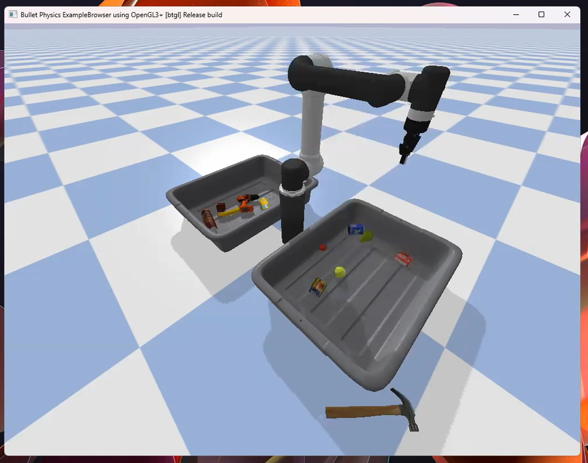
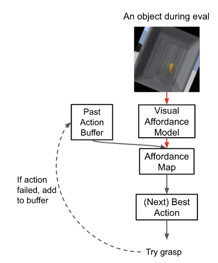

## 🚀 **Project Overview**  
- **Project Name:** Learning Visual Affordances for Robotic Grasping  
- **Role:** Machine Learning & Robotics Engineering  
- **Technologies:** PyTorch, MiniUNet, PyBullet, Computer Vision, Pose Estimation
- **Class:** CS227A: Robot Perception  
- **Duration:** 3 Homeworks (Progressive System Development)  
- **Key Contributions:** Deep learning for grasp detection, pose estimation, failure suppression  

---

  

## 📖 **Project Summary**  
This project explores **affordance-based grasping**, where a **neural network predicts the best graspable points in images**.  
Using a **fully convolutional MiniUNet**, the system generates **affordance maps**—highlighting optimal grasp locations—  
and refines its actions through **pose estimation and test-time learning**.  

To evaluate real-world applicability, the model was tested in **PyBullet** on both **seen and unseen objects**,  
demonstrating **strong generalization** despite a small training dataset. Additionally, a **failure suppression strategy**  
was implemented, allowing the robot to **adapt in real time** and recover from repeated grasping errors.  

### **Key Features Implemented:**  
✅ **Deep Learning for Grasp Prediction** – Learned **pixel-wise affordances** for identifying optimal grasp locations.  
✅ **Pose EsDtimation via ICP** – Used **3 alignment techniques** to improve grasp accuracy.  
✅ **Failure Suppression Strategy** – Implemented a **past-failure memory**, increasing grasp efficiency in cluttered scenes.  
✅ **Simulation-Based Testing** – Evaluated in **PyBullet**, handling a variety of object configurations.  

---

## 🛠️ **Key Technologies & Concepts**  
- **Visual Affordance Learning** – Using deep learning to **predict graspable areas** from RGB images.  
- **MiniUNet Architecture** – A **lightweight convolutional network** designed for affordance prediction.  
- **PyBullet Simulation** – Simulated a **robotic arm performing grasping tasks** in a physics-based environment.  
- **Test-Time Adaptation** – Integrated **failure suppression techniques** to improve long-term grasp efficiency.  
- **Pose Estimation via ICP** – Aligned **3D object models** for better grasp planning.  

---

## 🚀 **Results**  
- Trained on a small dataset but generalized well to novel objects.
- Test-time improvements allowed the model to recover from repeated failures.  
- Successfully handled cluttered scenes and multi-object grasping.

---

## 🎥 **Demo Videos**  
**📹 Before Failure Suppression:**  

  
  <iframe src="https://drive.google.com/file/d/1FY9rdOd35DRLGNuxurzvI1DdbbB6LSip/preview" width="640" height="480" allow="autoplay"></iframe>

  

**📹 After Failure Suppression:**  

  
  <iframe src="https://drive.google.com/file/d/1KcFWbbtJr6KcDM4SPQmMR1BiZhTnzvkk/preview" width="640" height="480" allow="autoplay"></iframe>

  

  

---

## 🚩 **Challenges & Solutions**  
- **Repeated grasp failures on certain objects**  
  - Introduced a **past-failure memory**, allowing the robot to select alternative grasp points.  

- **Difficulty handling cluttered environments**  
  - Improved **data augmentation** techniques to enhance robustness to unseen objects.  

- **Pose estimation errors led to grasp misalignment**  
  - Integrated **Iterative Closest Point (ICP)** to refine 3D object alignment.  

